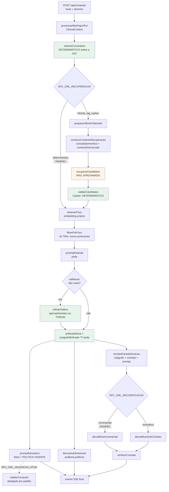
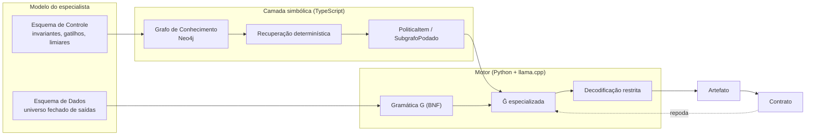
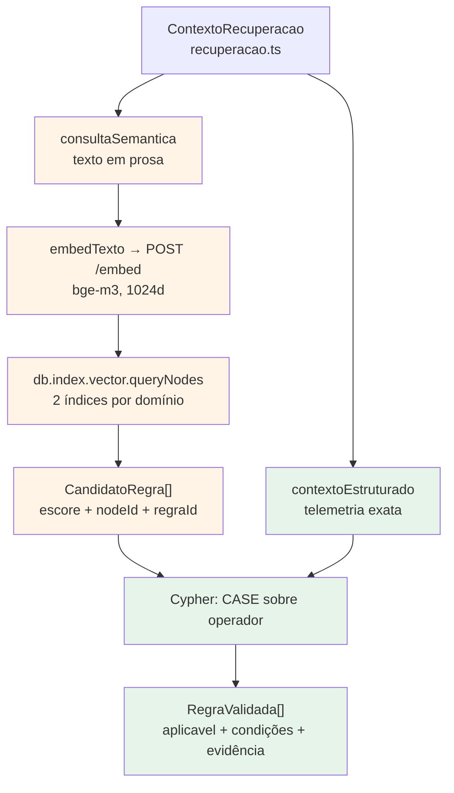
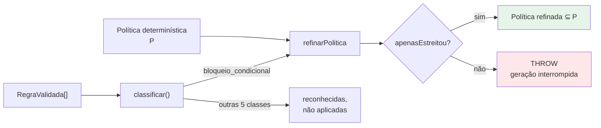
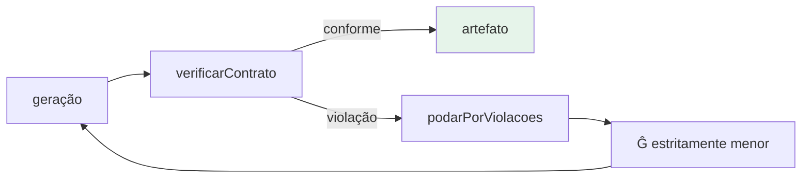

# SPC-CML — Compilador Semântico de Prompts

Middleware neuro-simbólico que interpõe uma **DSL formal**, um **Grafo de Conhecimento** e **decodificação restrita por gramática** entre a fala de um profissional e a ordem que um sistema crítico executa.

**Domínios instanciados:** terapia intensiva (`med`), pulverização aérea por drone (`agro`) e arbitragem de futebol (`fut`). A mesma maquinaria serve aos três; só os modelos do especialista mudam.

O problema que a arquitetura ataca é específico. Um LLM que traduz *"a pressão tá despencando, sobe a nora e aprofunda o propofol"* em uma ordem de bomba erra de duas maneiras distintas, que exigem remédios distintos:

| Tipo de erro | Exemplo | Mecanismo que o elimina |
|---|---|---|
| **Sintático** | emitir `dose 0.1 gotas/min`, ou prosa livre em vez da linguagem de ordens | Gramática BNF derivada da DSL + decodificação restrita |
| **Semântico** | aumentar Propofol com PAM 52 mmHg — sintaticamente perfeito, clinicamente perigoso | Grafo de Conhecimento avaliado sobre a telemetria, convertido em gramática |

A tese operacional do projeto é que o segundo pode ser reduzido ao primeiro: **se o grafo determina que aumentar Propofol é proibido agora, essa cadeia é removida da gramática e o decodificador não consegue emiti-la.** O erro semântico deixa de ser algo a detectar depois e passa a ser inexprimível.

> **Sobre este documento.** Ele descreve o que o código faz hoje, verificado contra os arquivos e a suíte de testes (última conferência: 2026-09-24, ver §18). Onde há distância entre a arquitetura pretendida e a implementada, isso está marcado como **PROPOSTA** ou **PARCIAL**. Trechos assim não descrevem comportamento existente.

---

## Índice

1. [Fluxo de execução real](#1-fluxo-de-execução-real)
2. [Arquitetura em camadas](#2-arquitetura-em-camadas)
3. [Os dois esquemas da DSL](#3-os-dois-esquemas-da-dsl)
4. [Recuperação determinística](#4-recuperação-determinística)
5. [Recuperação híbrida: RAG + Cypher](#5-recuperação-híbrida-rag--cypher)
6. [VETA, PROIBE e AJUSTA](#6-veta-proibe-e-ajusta)
7. [Refinamento seguro da política](#7-refinamento-seguro-da-política)
8. [Prompt Semântico](#8-prompt-semântico)
9. [Grammar Prompting e geração restrita](#9-grammar-prompting-e-geração-restrita)
10. [Validação, reparo e contrato](#10-validação-reparo-e-contrato)
11. [Auditoria e rastreabilidade](#11-auditoria-e-rastreabilidade)
12. [Política por Item (PI)](#12-política-por-item-pi)
13. [Modos de execução](#13-modos-de-execução)
14. [API e endpoints](#14-api-e-endpoints)
15. [Variáveis de ambiente](#15-variáveis-de-ambiente)
16. [Instalação](#16-instalação)
17. [Como rodar](#17-como-rodar)
18. [Testes](#18-testes)
19. [Mapa de rastreabilidade](#19-mapa-de-rastreabilidade)
20. [Limitações e divergências conhecidas](#20-limitações-e-divergências-conhecidas)
21. [Referências](#21-referências)

---

## 1. Fluxo de execução real

Esta é a seção central do documento: o que efetivamente acontece quando uma entrada percorre o sistema. Cada passo indica arquivo, função, entrada, saída e se a decisão é **determinística** (comparação numérica ou estrutural) ou **generativa** (LLM).

O caminho descrito é o do servidor web, que é o pipeline produtivo. Os outros pontos de entrada (§13) montam o cenário por conta própria e reaproveitam só parte do caminho: a CLI, os passos 3, 6 (sem sinal vetorial), 7, 8, 12 e 13; os clientes de lote, 3, 8, 12 e 13, sem foco. Nenhum deles passa pelo modo híbrido (5, 9) nem pela política efetiva do servidor (10).

### 1.1 Passo a passo

```text
 1. ENTRADA HTTP                                                 [obrigatório]
    arquivo:  src/web/server.ts
    rota:     POST /api/comando  (resposta em SSE)
    entrada:  { dominio: 'med'|'agro'|'fut', texto: string, contexto?: {...} }
    saída:    despacha para processarMed | processarAgro | processarFut
         ↓
 2. MONTAGEM DO CENÁRIO                                          [obrigatório]
    arquivo:  src/web/server.ts
    função:   processarMed(texto, estagio, contextoForcado?)
    entrada:  texto + contexto do lote, OU sorteio de
              src/examples/med/pacientes.jsonl + telemetrias.jsonl
    saída:    ClinicalContext { telemetria, paciente, populacoes,
                                farmacosEmUso, intencao }
    decisão:  determinística (leitura de arquivo / sorteio)
         ↓
 3. RECUPERAÇÃO DETERMINÍSTICA                                   [obrigatório]
    arquivo:  src/knowledge/graphrag.ts
    função:   retrieveConstraints(model, contexto)
    entrada:  AST da DSL (uti.dsl) + ClinicalContext
    saída:    RetrievedConstraints { protocolosAtivos, bloqueios, vetados,
                                     ajustes, recomendados, escalonamentos,
                                     interacoes, regrasGlobais,
                                     politicas: Map<item,DrugPolicy> }
    decisão:  DETERMINÍSTICA — compara telemetria com limiares da DSL
    nota:     lê a AST do Langium, NÃO o Neo4j
         ↓
 4. ESCOLHA DO MODO                                              [obrigatório]
    arquivo:  src/knowledge/recuperacao-hibrida.ts
    função:   modoRecuperacao()
    entrada:  SPC_CML_RECUPERACAO
    saída:    'deterministica' (PADRÃO) | 'hibrida_rag_cypher'
         ↓
 5. PREPARO HÍBRIDO                                  [condicional: só híbrido]
    arquivo:  src/knowledge/recuperacao-hibrida.ts
    função:   prepararHibridoTolerante(dominio, contexto, session)
    ├─ 5a. construirContextoRecuperacao()        src/knowledge/recuperacao.ts
    │      saída: ContextoRecuperacao { consultaSemantica, contextoEstruturado }
    ├─ 5b. recuperarCandidatos()                 src/knowledge/recuperacao-rag.ts
    │      embedTexto(consultaSemantica) → POST /embed → vetor bge-m3 (1024d)
    │      db.index.vector.queryNodes(2 índices) → CandidatoRegra[] + escore
    │      decisão: APROXIMADA (similaridade de cosseno)
    └─ 5c. validarCandidatos()                   src/knowledge/recuperacao-cypher.ts
           Cypher avalia parametro/operador/limiar → RegraValidada[]
           decisão: DETERMINÍSTICA (CASE sobre o operador, no banco)
    saída:    { sinal: SinalVetorial, validadas: RegraValidada[], auditoria }
    falha:    degrada para o baseline, motivo em auditoria.degradou
         ↓
 6. FOCO SEMÂNTICO                                               [obrigatório]
    arquivo:  src/knowledge/graphrag.ts
    função:   retrieverFoco(session, texto, model, sinal?)
    entrada:  texto + (no híbrido) o sinal vetorial já calculado no passo 5b
    saída:    Foco { farmacos, protocolos, origem }
    decisão:  APROXIMADA — decide o que é MOSTRADO, nunca o que é permitido
    nota:     com `sinal`, NÃO refaz embedding nem busca vetorial
    falha:    embedding ou Neo4j fora → segue com o grafo completo (o passo 7
              não roda), motivo em `focoIndisponivel`
         ↓
 7. FILTRO POR FOCO                                              [obrigatório]
    arquivo:  src/knowledge/graphrag.ts
    função:   filtrarPorFoco(constraints, foco, model, contexto)
    saída:    RetrievedConstraints restrito; políticas RECOMPUTADAS
    invariante: o foco só TIRA decisões admissíveis, nunca acrescenta
         ↓
 8. MONTAGEM DA POLÍTICA (poda)                                  [obrigatório]
    arquivo:  src/knowledge/graphrag.ts → src/knowledge/politica.ts
    função:   poda = pruningPayload(constraints, contexto) → montarSubgrafo(...)
    saída:    SubgrafoPodado { politicas: PoliticaItem[], papeis,
                               constantes, + 3 chaves legadas }
    decisão:  DETERMINÍSTICA
         ↓
 9. REFINAMENTO                             [condicional: validacao não vazia]
    arquivo:  src/knowledge/recuperacao-politica.ts
    função:   refinarPolitica(poda, auditoriaRecuperacao.validacao)
    ├─ classificar(regra) → 6 classes; só `bloqueio_condicional` refina
    ├─ agruparPorItem(validadas)
    └─ apenasEstreitou(poda, refinado) → THROW se ampliou (fail-closed)
    saída:    ReconciliacaoPolitica { subgrafo, ajustes, divergencias, concordam }
              → subgrafoRefinado = rec.subgrafo
              → auditoriaRecuperacao.reconciliacaoPolitica (sem o subgrafo)
    decisão:  DETERMINÍSTICA
    nota:     `validacao` só tem regras no modo híbrido que não degradou. No
              determinístico (padrão), ou se o híbrido degradou, este passo
              não roda e `subgrafoRefinado` fica indefinido
         ↓
10. POLÍTICA EFETIVA                                             [obrigatório]
    arquivo:  src/web/server.ts  (processarMed | processarAgro | processarFut)
    código:   politicaEfetiva = subgrafoRefinado ?? poda
    uso:      calculada UMA vez por requisição; a MESMA variável alimenta
    ├─ auditoriaRecuperacao.politicas ← { item, decisoes, bloqueado } por item
    ├─ promptSemantico = montarPromptSemantico(constraints, contexto,
    │                                          politicaEfetiva)
    ├─ gerarPlanoRestrito(contexto, constraints, model, politicaEfetiva) → 12
    └─ decisoesAdmissiveis = politicaEfetiva.acoes_permitidas
    idem:     montarPromptSemanticoAgro|Fut, gerarMissaoRestrita,
              gerarArbitragemRestrita
    decisão:  DETERMINÍSTICA (escolha estrutural, sem LLM)
         ↓
11. VALIDAÇÃO DO COMANDO           [condicional: SPC_CML_VALIDACAO_ATIVA=true]
    arquivo:  src/web/server.ts
    função:   validarComando(texto, promptSemantico, motor)
              → POST /validar-comando
    saída:    { compreensivel, motivo }; se recusado, o evento `final` sai com
              aceito: false, sem decisoesAdmissiveis nem auditoriaRecuperacao,
              e a geração NÃO acontece
    decisão:  GENERATIVA (LLM sob gramática fixa)
    padrão:   desligada
         ↓
12. ENTRADA DA GERAÇÃO                                           [obrigatório]
    arquivo:  src/inference/llm-client.ts  (idem agro-client.ts, fut-client.ts)
    função:   montarEntradaGeracao(contexto, constraints, model, subgrafoRefinado?)
              — o servidor passa `politicaEfetiva` como 4º argumento
    ├─ subgrafo = subgrafoRefinado ?? pruningPayload(constraints, contexto)
    │     servidor: sempre `politicaEfetiva` — a poda interna NÃO roda
    │     CLI/lote: argumento ausente — a poda determinística é feita aqui
    ├─ contrato = montarContrato(subgrafo, condutasPorDecisaoMed(model),
    │                            escalonamentos, esquemaDeDadosMed(model))
    └─ prompt   = montarPromptSemantico(constraints, contexto, subgrafo)
    saída:    OpcoesDecodificacao { comando, contexto: prompt, subgrafo,
                                    contrato, endpoint, timeoutMs }
    invariante: prompt, gramática e contrato leem o MESMO subgrafo. No
              servidor, o prompt enviado ao motor é idêntico ao
              `promptSemantico` da resposta (mesma função pura, mesmas entradas)
         ↓
13. DECODIFICAÇÃO                                                [obrigatório]
    arquivo:  src/inference/decodificacao.ts
    função:   decodificar(opts) → SPC_CML_DECODIFICACAO
    ├─ 'incremental' (PADRÃO) → decodificarIncremental
    └─ 'monolitica'           → decodificarSobContrato
         ↓
14. RESULTADO
    interno:  ResultadoDecodificacao { resultado, valido, erro, regras_em_g_hat,
                                       …, violacoes, conforme, tentativas,
                                       historico }
    API:      evento SSE `final` com resultado, valido, erroMotor, regrasEmGHat,
              promptSemantico, decisoesAdmissiveis e auditoriaRecuperacao
    nota:     violacoes, conforme, tentativas e historico NÃO saem na API (§14)
```

### 1.2 Passo 13a — decodificação incremental (padrão)

```text
decodificarIncremental()            src/inference/decodificacao.ts

 a. identificador   POST /generate-fragment, símbolo `identificador`
 b. sequência       até MAX_CONDUTAS posições; por posição até 3 tentativas
                    restringirACondutas(subgrafo, condutasRealizaveis(...))
                    verificarConduta() reprova → conduta sai da gramática do retry
 c. cláusulas       UMA por conduta aceita, na ordem da sequência
                    restringirADecisoes(subgrafo, decisoesDaConduta, itensJaUsados)
                    lerClausula() → verificarClausulaNova()
                    violação → podarPorViolacoes() → gramática do retry é MENOR
 d. alertas         até MAX_ALERTAS
 e. montarArtefato()  src/knowledge/contrato.ts
 f. verificarContrato()  veredito final
```

Cada fragmento é gerado sob a gramática que as validações anteriores deixaram de pé. O prefixo enviado ao motor é o artefato parcial — cabeçalho + sequência + cláusulas já aceitas.

### 1.3 Passo 13b — decodificação monolítica

```text
decodificarSobContrato()            src/inference/decodificacao.ts

 laço até MAX_TENTATIVAS (3):
   POST /generate-constrained  → artefato inteiro
   verificarContrato()
   conforme? → retorna
   senão     → podarPorViolacoes() → subgrafo estritamente menor → regera
               se a poda não encolheu, injeta relatorioDeViolacoes() no prompt
```

### 1.4 Diagrama do fluxo



Verde = determinístico. Laranja = aproximado. Tudo que sai de `politicaEfetiva` lê o mesmo objeto (§14).

---

## 2. Arquitetura em camadas



**Toda decisão de segurança acontece na camada simbólica.** O motor apenas não consegue emitir o que a gramática não gera.

### Separação de responsabilidades

| Camada | Decide | Natureza |
|---|---|---|
| Foco semântico / RAG | o que é **mostrado** | aproximada |
| Recuperação determinística | o que é **permitido** | determinística |
| Especialização de Ĝ | o que é **exprimível** | determinística |
| Contrato do artefato | o que é **coerente** | determinística |

---

## 3. Os dois esquemas da DSL

A DSL (Langium) é a fonte única de verdade e se parte em dois.

**Esquema de Controle** → alimenta o Grafo de Conhecimento: fármacos, protocolos, populações, invariantes de segurança, gatilhos, limiares, interações.

**Esquema de Dados** → alimenta a gramática: o universo fechado de decisões, vias/meios, unidades e condutas que uma saída pode conter.

| domínio | modelo | gramática gerada | símbolo inicial |
|---|---|---|---|
| `med` | [src/examples/med/uti.dsl](src/examples/med/uti.dsl) | `grammar/advanced_icu.bnf` | `plano` |
| `agro` | [src/examples/agro/lavoura.agro](src/examples/agro/lavoura.agro) | `grammar/agro_drone.bnf` | `missao` |
| `fut` | [src/examples/fut/futebol.fut](src/examples/fut/futebol.fut) | `grammar/futebol.bnf` | `arbitragem` |

A BNF é **gerada**, nunca editada à mão — [src/cli/export-bnf.ts](src/cli/export-bnf.ts) e irmãos.

### `PoliticaItem` — a unidade normativa

Definida em [src/knowledge/politica.ts](src/knowledge/politica.ts):

```ts
interface PoliticaItem {
    item: string;              // fármaco | produto | infração
    decisoes: string[];        // o que se pode decidir sobre ele
    meios: string[];           // via | modo | reinício
    unidades: string[];
    valores: ValorAdmissivel[];              // retículo derivado do modelo
    valoresPorDecisao?: Record<string, ValorAdmissivel[]>;  // mais estrito
    bloqueado: boolean;
    motivos: string[];         // justificativas legíveis
}
```

`valoresPorDecisao` é mais estrito que `valores`: o degrau de titulação vale para AUMENTAR, a dose inicial para INICIAR, zero para o que não movimenta a bomba.

---

## 4. Recuperação determinística

[`retrieveConstraints`](src/knowledge/graphrag.ts) (e `retrieveAgroConstraints`, `retrieveFutConstraints`) percorre a **AST da DSL** — não o Neo4j — e compara a telemetria com os limiares declarados.

A política de cada item nasce **aberta** (todas as decisões do `esquema_dados`) e é estreitada por:

1. **estado de curso** (`aplicarEstadoDeCurso`) — não se inicia o que já está em curso;
2. **invariantes** (`BlockRule`) — retiram as decisões de incremento;
3. **vetos** — reduzem às decisões de retirada;
4. **ajustes renais** com ação `suspender`/`bloquear` — retiram incrementos;
5. **ajustes por fator** — reescalam o retículo de valores (§6).

Regras cujo parâmetro não está na telemetria são **ignoradas**: ausência de medida não é evidência de normalidade, mas também não autoriza bloquear.

---

## 5. Recuperação híbrida: RAG + Cypher

> **Padrão: desligado.** `SPC_CML_RECUPERACAO=deterministica`. O modo híbrido é experimental e se ativa com `hibrida_rag_cypher`.



### 5.1 Contexto de recuperação

[`construirContextoRecuperacao`](src/knowledge/recuperacao.ts) é uma **projeção** do contexto do pipeline — não uma nova fonte de verdade. Ele separa duas representações da mesma entrada:

| | consulta semântica | contexto estruturado |
|---|---|---|
| destino | embedding / índice vetorial | Cypher / comparação numérica |
| forma | prosa | valores exatos |
| PAM 52 | `"... Sinais do paciente: PAM 52"` | `{ PAM: 52 }` (number) |
| ID do sujeito | **excluído** (ID interno, ruído) | `sujeito: 'PT-2026-0031'` |

**A consulta semântica não substitui a telemetria estruturada.** Ela cita o número; quem o compara com o limiar é o Cypher.

Composição da consulta (`montarConsultaSemantica`), por segmentos fixos: fala do usuário → ambiente do domínio → enquadramentos → estado de curso → sinais. Os sinais que o usuário citou pelo nome vêm primeiro; o bloco é limitado por `SPC_CML_RAG_MAX_SINAIS` (8) para não diluir a intenção.

### 5.2 Índices vetoriais

Seis índices, dois por domínio, todos `cosine`/1024d, criados por `database/neo4j*.ts`:

| domínio | índice de item | label | índice de contexto | label |
|---|---|---|---|---|
| med | `farmaco_embedding` | `Farmaco` | `protocolo_embedding` | `Protocolo` |
| agro | `produto_embedding` | `Produto` | `cultura_embedding` | `Cultura` |
| fut | `infracao_embedding` | `Infracao` | `lance_embedding` | `Lance` |

`topK` (`SPC_CML_RAG_TOP_K`, padrão 10) é **por índice**, sem teto global — um corte global deixaria uma família de nós silenciar a outra, o que seria o RAG decidindo.

### 5.3 O escore não é validade

```
escore = RELEVÂNCIA SEMÂNTICA da recuperação

escore NÃO é validade.   escore NÃO é autorização.
escore mais alto NÃO é "a regra escolhida".
```

Auditado em [recuperacao-rag.ts](src/knowledge/recuperacao-rag.ts): as únicas operações sobre `escore` são carregar adiante, reconstruir do cosseno quando ausente, e ordenar para apresentação. Nenhuma comparação, nenhum limiar, nenhum filtro.

### 5.4 Validação por Cypher

[`recuperacao-cypher.ts`](src/knowledge/recuperacao-cypher.ts) executa a comparação **no banco**:

```cypher
MATCH (alvo:`Farmaco` { nome: $nome })
MATCH (alvo)-[rel]-(regra)
WHERE regra.parametro IS NOT NULL
WITH regra, rel, coalesce(regra.limiar, regra.valor) AS esperado,
     $telemetria[regra.parametro] AS observado
RETURN ..., CASE WHEN observado IS NULL THEN NULL
                 WHEN regra.operador = '<' THEN observado < esperado
                 ... END AS satisfeita
```

O filtro `parametro IS NOT NULL` seleciona exatamente cinco tipos de nó:

| tipo | dono | campo do valor | relação |
|---|---|---|---|
| `RegraSeguranca` | item | `limiar` | `BLOQUEIA_INCREMENTO` \| `BLOQUEIA` |
| `AjusteRenal` | fármaco | `limiar` | `EXIGE_AJUSTE` |
| `Gatilho` | contexto | `valor` | `DISPARA` |
| `Escalonamento` | contexto | `valor` | `ESCALONA` |
| `Limiar` | infração | `valor` | `TEM_LIMIAR` |

**Nós com parâmetro não são toda a política.** Vetos, proibições e ajustes por fator são **arestas sem parâmetro** e nunca aparecem em `RegraValidada[]` — chegam à política por outro caminho determinístico (§6). É por isso que o refinamento estreita em vez de reconstruir.

Quando a telemetria não traz o parâmetro, a condição vira **lacuna**, não falsidade: `aplicavel = false`, `condicoesFalhas` vazio, `lacunas` preenchido.

---

## 6. VETA, PROIBE e AJUSTA

Verificado no grafo e no código:

| relação | de → para | propriedades | transformação na política | depende de |
|---|---|---|---|---|
| `VETA` | Protocolo/Cultura/Lance → item | `motivo` | `decisoes = filter(DECISOES_DE_RETIRADA)`, `bloqueado = true` | item + **contexto em foco** |
| `PROIBE` | Populacao/Area/Contexto → item | `motivo` | idem | item + **estado do sujeito** |
| `AJUSTA` | Populacao/Area/Contexto → item | `motivo`, **`fator`** | **`escalar(valores, fator)` + `escalarMapa(valoresPorDecisao, fator)`** | item + estado |

Três consequências:

**`AJUSTA` não remove decisão alguma.** Ele reescala o retículo de valores por um fator (0.5, 0.75 no modelo clínico). Descrevê-lo como remoção de decisões seria descrever outra coisa.

**`VETA` depende do foco**; `filtrarPorFoco` só mantém vetos cujo protocolo está em foco. **`PROIBE` depende do estado do sujeito** (população/área), que vem do contexto — ausência de recuperação semântica nunca pode revogá-lo.

**Nenhuma das três é visível ao Cypher de validação**, porque nenhuma é nó com `parametro`.

---

## 7. Refinamento seguro da política

[`recuperacao-politica.ts`](src/knowledge/recuperacao-politica.ts). O refinamento **estreita** a política determinística; nunca a reconstrói.

### 7.1 `classificar()` — seis classes

| classe | origem | refina a política? |
|---|---|---|
| `bloqueio_condicional` | `BLOQUEIA`/`BLOQUEIA_INCREMENTO`, ou `EXIGE_AJUSTE` com ação `suspender`/`bloquear` | **SIM** |
| `ativacao_de_contexto` | `DISPARA`, `EXIGE_AJUSTE` com outra ação | não |
| `escalonamento` | `ESCALONA` | não |
| `sancao` | `TEM_LIMIAR` | não |
| `nao_incidente` | regra cujas condições são falsas | não |
| `sem_evidencia` | parâmetro não medido | não |

Só a primeira altera a política. As outras cinco existem para registrar que foram **reconhecidas e deliberadamente não aplicadas** — não esquecidas.

### 7.2 `refinarPolitica()` e a não-ampliação

```
Política refinada ⊆ Política determinística
```

Verificado por `apenasEstreitou(antes, depois)` sobre **itens e decisões**: nenhum item novo, nenhuma decisão que não estivesse na política original. A garantia roda **em runtime**, não só em teste:

```ts
if (!apenasEstreitou(subgrafo, refinado)) {
    throw new Error('refinamento da politica ampliou permissoes: ...');
}
```

**Fail-closed:** a exceção sobe até o handler SSE e a geração não acontece. Não há fallback silencioso para a política mais ampla.

Os testes verificam adicionalmente que **meios** e **valores** também não crescem ([recuperacao-politica.test.ts](src/test/recuperacao-politica.test.ts), TESTE 16).

**Onde roda e para onde vai.** Só em `server.ts`, e só quando `auditoriaRecuperacao.validacao` não está vazia — na prática, no modo híbrido sem degradação. O `rec.subgrafo` vira `subgrafoRefinado` e, por meio de `politicaEfetiva` (§1, passo 10), é a política que chega ao prompt, à gramática, ao contrato e à resposta da API. `montarEntradaGeracao*` não repete `apenasEstreitou`: a checagem fica em `refinarPolitica`, o único ponto que tem as duas políticas em mãos. O teste 13 de `test:geracao` verifica que uma decisão retirada pelo refinamento não chega ao gerador nem ao contrato.

### 7.3 Lista vazia ≠ ausência de permissões

`RegraValidada[] = []` significa **"o RAG nada acrescentou"**, não **"nada é permitido"**. A política determinística passa intacta. Interpretar silêncio como proibição daria ao RAG poder de veto por omissão — exatamente o que a arquitetura proíbe.

No servidor, a lista vazia nem chega a chamar `refinarPolitica`: `politicaEfetiva` é a própria poda. Chamada diretamente com `[]`, `refinarPolitica` devolve a poda inalterada (`test:politica`, TESTE 9; `test:geracao`, teste 12).

### 7.4 Divergências

Regras restritivas que incidem sobre item **ausente da política** são registradas como divergência sem alterar nada. A causa mais comum **não é defeito**: é o foco. Medido no cenário de referência, `plaquetas 45 < 50` incide sobre Heparina, que o foco não trouxe. Isso difere de uma regra incidente sobre item **em foco**, que refina de fato.



---

## 8. Prompt Semântico

[`montarPromptSemantico`](src/inference/llm-client.ts) e irmãos montam o bloco factual que o LLM lê. Cada linha saiu de uma comparação numérica, não de suposição.

Blocos factuais, nesta ordem (nomes do domínio `med`; `agro` e `fut` têm equivalentes próprios): `[CENARIO]`, `[PROTOCOLOS EM FOCO]`, `[INCREMENTOS BLOQUEADOS — invariantes de seguranca]`, `[FARMACOS VETADOS NESTE CONTEXTO]`, `[AJUSTES DE DOSE EXIGIDOS]`, `[ESCALONAMENTOS DISPARADOS]`, `[INTERACOES ENTRE FARMACOS EM USO]`, `[RECOMENDADOS PELO PROTOCOLO]`, `[INVARIANTES GLOBAIS]`. `[CENARIO]` só aparece quando o contexto é passado; os demais somem quando vazios, exceto `[INVARIANTES GLOBAIS]`.

### A política vigente no prompt

`montarPromptSemantico*` aceita um terceiro parâmetro opcional: a política efetivamente vigente, um `SubgrafoPodado`. No caminho de geração ele vem **sempre, nos dois modos de recuperação**. `montarEntradaGeracao*` repassa o mesmo `subgrafo` que vira gramática e contrato, e o servidor monta o `promptSemantico` da resposta com `politicaEfetiva` (§1, passos 10 e 12). No modo determinístico, que é o padrão, essa política é a poda. No híbrido com regras validadas, é a refinada.

Com o parâmetro, acontecem duas coisas.

**1. Recomendações são anotadas, nunca apagadas.** Que o protocolo recomende um item continua sendo um fato do domínio; apagá-lo empobreceria o contexto que o modelo usa para justificar a decisão. `anotarRecomendacao` acrescenta, **na mesma linha**, a informação que faltava:

| situação do item na política vigente | anotação |
|---|---|
| presente e admite alguma decisão de incremento (`papeis.decisoesDeIncremento`) | nenhuma |
| presente, sem nenhuma decisão de incremento | `(recomendado, mas sem decisao de incremento admissivel agora)` |
| ausente (em geral porque o foco não o trouxe) | `(fora da politica vigente neste cenario)` |

**2. Um bloco de autoridade fecha o prompt.** `blocoPoliticaEfetiva` lista cada item com as decisões que restaram e marca `[RESTRITO]` os bloqueados, repetindo os `motivos` só para esses. Fatos primeiro, o que se pode decidir por último. Item sem decisão sai como `(nenhuma decisao admissivel)`; política sem itens não gera bloco.

Saída real, no modo determinístico, para o cenário de referência de [llm-client.ts](src/inference/llm-client.ts) (PT-2026-0031: PAM 52, FC 145; Noradrenalina, Propofol e Vancomicina em curso), sobre o grafo completo, sem o filtro de foco. Trechos:

```
[RECOMENDADOS PELO PROTOCOLO]
- Noradrenalina: vasopressor de primeira linha para PAM < 65 mmHg (Choque_Septico) (recomendado, mas sem decisao de incremento admissivel agora)
- Vasopressina: segunda linha poupadora de catecolamina (Choque_Septico)
...
[POLITICA VIGENTE — o que e exprimivel neste cenario]
(esta lista e a autoridade: a gramatica so gera o que esta aqui)
- Noradrenalina [RESTRITO]: REDUZIR_VAZAO, MANTER_VAZAO, MANTER_BLOQUEADO, SUSPENDER, SUBSTITUIR, SOLICITAR_EXAME, ESCALAR_EQUIPE, BLOQUEAR_ORDEM
    motivo: ja em curso: nao cabe iniciar de novo
    motivo: incremento bloqueado (FC 145 > 130 bpm): risco de taquiarritmia e fibrilacao atrial
- Adrenalina: INICIAR_INFUSAO, MANTER_BLOQUEADO, SUBSTITUIR, SOLICITAR_EXAME, ESCALAR_EQUIPE, BLOQUEAR_ORDEM
...
- Propofol [RESTRITO]: REDUZIR_VAZAO, MANTER_VAZAO, MANTER_BLOQUEADO, SUSPENDER, SUBSTITUIR, SOLICITAR_EXAME, ESCALAR_EQUIPE, BLOQUEAR_ORDEM
    motivo: ja em curso: nao cabe iniciar de novo
    motivo: incremento bloqueado (PAM 52 < 60 mmHg): risco de hipotensao severa e colapso hemodinamico
```

Quando o refinamento estreita um item, o motivo que ele acrescenta vem no formato de `refinarPolitica`, `<tipo> (<parâmetro> <observado> <exigido>): <razão>`, em vez do `incremento bloqueado (...)` da recuperação determinística.

**Sem o parâmetro, o prompt sai exatamente como sempre saiu**, sem anotação e sem bloco. Quem ainda chama assim:

| chamador | por quê |
|---|---|
| `scripts/gerar-ground-truth-*.ts` | o gabarito precisa de texto estável |
| `/api/avaliar` (`avaliarRegistro*` em `server.ts`) | o juiz de `/validar-plano` recebe esse texto, sem `[CENARIO]`, como contexto |
| exibição no console de `cli.ts`, dos clientes de lote, de `inspecionar-foco.ts` e do `main()` de `llm-client.ts` | só log |

> ⚠️ A CLI e os clientes de lote **imprimem** o prompt legado, mas o que **enviam** ao motor (via `gerar*Restrito` → `montarEntradaGeracao*`) traz a anotação e o bloco, montados com a poda. O log do console não é o texto que o LLM leu.

Helpers em [politica.ts](src/knowledge/politica.ts): `blocoPoliticaEfetiva`, `anotarRecomendacao`, `admiteIncremento`, todos agnósticos de domínio, via `papeis`. Cobertos por `test:geracao` (7 casos no bloco "o Prompt Semantico reflete a politica vigente").

---

## 9. Grammar Prompting e geração restrita

### 9.1 De G para Ĝ

[`grammar_from_kg.py`](src/python_engine/grammar_from_kg.py), quatro fases:

**Fase 0 — `especializar_por_item`.** Reescreve a regra da cláusula em uma produção **por item**, cada uma com as decisões, meios e valores daquele item. Sem ela, `ordem ::= "ordem" farmaco "decisao" decisao ...` é um produto cartesiano e basta um item admitir `INICIAR_INFUSAO` para todos admitirem.

Fixa também como literais o que é **dado** do cenário: sujeito e contextos.

**Fases 1–3.** Poda dos vocabulários fechados (`MAPA_PODA`), remoção de símbolos não geradores, varredura de alcance a partir do símbolo inicial.

### 9.2 Decodificação restrita

Backend padrão `llamacpp`: a Ĝ vira GBNF (`to_gbnf`) e o llama.cpp mascara logits em C++. O backend `outlines` existe para comparação de desempenho — reconstrói um FSM sobre todo o vocabulário a cada terminal, o que nesta gramática não termina em tempo útil.

Chamadas ao llama.cpp são serializadas por `_LLAMA_LOCK` (RLock) em [main.py](src/python_engine/main.py).

---

## 10. Validação, reparo e contrato

| nível | onde | o que verifica |
|---|---|---|
| **Sintática** | `/generate-constrained` reparseia com Lark | pertence a L(Ĝ)? |
| **Sintática (cliente)** | `lerArtefato` / `lerClausula` por regex | os campos são legíveis? |
| **Semântica local** | `verificarClausulas` | item na poda, decisão admissível, meio, valor no retículo |
| **Relacional** | `verificarClausulas` acumulado | unicidade por item |
| **Global** | `verificarArtefato` | sequência ↔ cláusulas, escalonamento coberto, sujeito, contexto, artefato vazio |

> ⚠️ **`/generate-fragment` NÃO reparseia o fragmento.** A garantia sintática ali vem apenas da máscara GBNF; no cliente, a leitura é por regex. Só o caminho monolítico reparseia.

### Reparo

`podarPorViolacoes(subgrafo, violacoes)` devolve um subgrafo **estritamente menor**: o par (item, decisão) que falhou sai da política e, com ele, da gramática. A tentativa seguinte não consegue repetir o erro.



---

## 11. Auditoria e rastreabilidade

`AuditoriaRecuperacao` ([recuperacao-hibrida.ts](src/knowledge/recuperacao-hibrida.ts)) acompanha toda resposta aceita de `/api/comando`, nos dois modos. É preenchida em duas etapas:

| campo | quem preenche | quando |
|---|---|---|
| `id`, `modo`, `dominio`, `intencao` | `auditoriaVazia` ou `prepararHibrido` | sempre |
| `consultaSemantica`, `topK`, `indices`, `telemetria`, `candidatos` (com escore), `validacao` (`RegraValidada[]` estruturado) | `prepararHibrido` | só no híbrido que não degradou; fora dele ficam vazios (`''`, `0`, `[]`, `{}`) |
| `degradou` | `prepararHibridoTolerante` | quando o híbrido falhou e caiu no baseline |
| `foco` | `server.ts` | quando o foco foi calculado |
| `politicas` | `server.ts`, a partir de `politicaEfetiva` | sempre |
| `reconciliacaoPolitica` | `server.ts`, a partir de `refinarPolitica` | só quando `validacao` não está vazia |

`test:rastro` verifica os dez pontos da trilha que `prepararHibrido` produz: id e intenção, consulta semântica, topK e índices, candidato, escore, validação, condições satisfeitas, condições falhas, telemetria e `regraId`. Os campos que só `server.ts` preenche não têm teste direto; `politicas` é conferido em `test:geracao`, que reproduz a composição do servidor.

**Nunca "regra = aceita" sozinho.** `explicarRegra()` produz uma linha como:

```
Farmaco:Propofol/RegraSeguranca/PAM<60 REJEITADA (escore RAG 0.8244) porque PAM observado 82, exigido < 60 mmHg
```

Leitores: `regrasAceitas`, `regrasRejeitadas`, `regrasSemEvidencia`, `rastrearRegra(auditoria, regraId)`, `relatorioAuditoria`.

A trilha é **metadado de execução**: não entra no artefato, na DSL nem na saída do usuário.

---

## 12. Política por Item (PI)

### 12.1 Estado real

**PARCIAL.** Existe [`src/knowledge/item-geracao.ts`](src/knowledge/item-geracao.ts) com `ContextoGeracaoItem`, `subgrafoDeItem`, `contextosPorItem`, `ordenarPorOrigem` e `itensQueAdmitem`.

| | estado |
|---|---|
| módulo existe | sim |
| **testes** | **não — nenhum** |
| **integrado ao fluxo** | **não — nenhum arquivo o importa** |
| paralelismo físico | **não** |

O módulo é preparação arquitetural sem cobertura nem uso. Não confie nele como comportamento verificado.

### 12.2 O que já é por item, de fato

A especialização da gramática **já é por item** desde `especializar_por_item`. Verificado contra o motor: com uma única política no payload, a BNF sai como `ordem ::= ordem_noradrenalina` e nenhum outro item aparece. **O lado Python não precisa de alteração para gerar por item.**

### 12.3 O que bloqueia a paralelização — PROPOSTA

Três acoplamentos reais no fluxo atual:

1. **Prefixo textual global** — cada `/generate-fragment` recebe o artefato parcial completo;
2. **Estado acumulado** — `restringirADecisoes(..., estado.clausulas.map(c => c.item))` e `condutasRealizaveis(contrato, estado)`;
3. **Ordem imposta** — as cláusulas seguem a ordem das condutas declaradas.

E um limite físico: `_LLAMA_LOCK` serializa toda chamada ao motor. Paralelismo lógico não reduz latência sem `n_parallel` ou múltiplos processos.

**Nada disso está implementado.** Não há `Promise.all`, worker ou processo concorrente em nenhum ponto do repositório.

---

## 13. Modos de execução

### Pontos de entrada

| entrada | arquivo | uso |
|---|---|---|
| Servidor web (SSE) | [src/web/server.ts](src/web/server.ts) | pipeline produtivo, front Vue |
| CLI interativa | [src/inference/cli.ts](src/inference/cli.ts) | exploração manual |
| Lote | [batch-client.ts](src/inference/batch-client.ts), `agro-client`, `fut-client` | experimentos |
| Demonstração Earley | [src/cli/pipeline.ts](src/cli/pipeline.ts) | caminho sem máscara, isolado |

> `cli.ts` e os clientes de lote usam **somente o modo determinístico**. O modo híbrido, o refinamento e a `politicaEfetiva` estão integrados apenas em `server.ts`. Nos outros pontos, `gerar*Restrito` é chamado sem subgrafo e `montarEntradaGeracao*` faz a poda determinística, que também chega ao prompt enviado ao motor (§8). Os clientes de lote não calculam foco.

### Duas chaves independentes

| variável | valores | padrão |
|---|---|---|
| `SPC_CML_RECUPERACAO` | `deterministica` \| `hibrida_rag_cypher` | `deterministica` |
| `SPC_CML_DECODIFICACAO` | `incremental` \| `monolitica` | `incremental` |

Valor desconhecido em `SPC_CML_RECUPERACAO` cai no padrão em vez de derrubar o serviço.

---

## 14. API e endpoints

### Motor Python (FastAPI)

| método | rota | função |
|---|---|---|
| GET | `/health` | estado, domínio, backend, modelo carregado |
| GET | `/grammar` | G em Lark e GBNF |
| POST | `/verify` | plano ∈ L(Ĝ)? |
| POST | `/validar-comando` | filtro prévio (LLM sob gramática fixa) |
| POST | `/validar-plano` | julgamento de plano gerado (avaliação em lote) |
| POST | `/embed` | vetor bge-m3 |
| POST | `/generate-constrained` | artefato inteiro + reparse |
| POST | `/generate-fragment` | um não-terminal, sobre um prefixo |

### Servidor web (node:http)

| método | rota |
|---|---|
| GET | `/api/dominios`, `/api/health`, `/api/chats`, `/api/chats/:id` |
| POST | `/api/comando` (SSE), `/api/chats`, `/api/avaliar` |
| PUT | `/api/chats/:id` |

#### Campos de política: uma fonte só

Em `server.ts`, `politicaEfetiva = subgrafoRefinado ?? poda` é calculada **uma vez** por requisição (§1, passo 10) e consumida por **todos**:

```
politicaEfetiva
   ├── Prompt Semântico   (anotações + bloco [POLITICA VIGENTE], §8)
   ├── Gramática Ĝ        (o subgrafo de montarEntradaGeracao*)
   ├── Contrato           (montarContrato, dentro de montarEntradaGeracao*)
   ├── decisoesAdmissiveis
   └── auditoriaRecuperacao.politicas
```

É a poda determinística, a não ser que o modo híbrido tenha devolvido regras validadas; nesse caso, é a refinada. O `promptSemantico` da resposta é o mesmo texto que vai ao motor: as duas montagens chamam a mesma função pura com as mesmas entradas.

Como ler os campos:

- `decisoesAdmissiveis` é a **união** das decisões de todos os itens (`acoes_permitidas`, uma chave legada). Uma decisão listada ali é admissível para **algum** item, não necessariamente para todos. A visão por item está em `auditoriaRecuperacao.politicas`.
- Os dois campos descrevem a política **na entrada da decodificação**. A repoda por violações durante a geração (`podarPorViolacoes`, §10) produz subgrafos novos e não os altera.

Nenhum campo de política da resposta anuncia uma decisão que a gramática inicial não admite. Isso é verificado em `test:geracao` (4 casos no bloco "a resposta da API reflete a politica efetiva"), que **reproduz** a composição de `server.ts`: `processarMed` não é exportada e o servidor não tem teste próprio. A reprodução cobre só `med`; `processarAgro` e `processarFut` têm a mesma forma, conferida apenas por leitura do código.

**`POST /api/comando`** — eventos SSE `estagio`, `final`, `erro`:

```jsonc
// entrada
{ "dominio": "med", "texto": "PAM 52, sobe a nora", "contexto": { /* opcional */ } }

// event: final
{ "aceito": true, "sorteio": {...}, "foco": {...}, "promptSemantico": "...",
  "decisoesAdmissiveis": [...], "resultado": "plano ...", "valido": true,
  "erroMotor": null, "regrasEmGHat": ...,
  "auditoriaRecuperacao": { "id": "rec-...", "modo": "...", "validacao": [...],
                            "politicas": [...], "reconciliacaoPolitica": {...} } }
```

Com `contexto`, o cenário vem do corpo em vez do sorteio. `focoIndisponivel` aparece quando o foco falhou. Com `SPC_CML_VALIDACAO_ATIVA=true` e o comando recusado, o `final` traz `aceito: false`, `motivoValidacao`, `sorteio`, `foco` e `promptSemantico`, sem `decisoesAdmissiveis` nem `auditoriaRecuperacao`. `violacoes`, `conforme`, `tentativas` e `historico` da decodificação nunca são repassados.

---

## 15. Variáveis de ambiente

### Recuperação e geração

| variável | padrão | efeito |
|---|---|---|
| `SPC_CML_RECUPERACAO` | `deterministica` | modo de recuperação |
| `SPC_CML_DECODIFICACAO` | `incremental` | modo de decodificação |
| `SPC_CML_RAG_TOP_K` | `10` | candidatos **por índice** |
| `SPC_CML_RAG_MAX_SINAIS` | `8` | sinais na consulta semântica |
| `SPC_CML_MAX_TENTATIVAS` | `3` | tentativas no modo monolítico |
| `SPC_CML_MAX_TENTATIVAS_ELEMENTO` | `3` | tentativas por elemento |
| `SPC_CML_MAX_CONDUTAS` / `SPC_CML_MAX_ALERTAS` | `5` / `2` | tetos por lista |

### Foco

`SPC_CML_FOCO_COS_MINIMO` (0.3) · `SPC_CML_FOCO_MARGEM` (0.05) · `SPC_CML_FOCO_MAX` (4) · `SPC_CML_FOCO_TOPK_MAX` (10)

### Motor

`SPC_CML_DOMINIO` (`medico`) · `SPC_CML_BACKEND` (`llamacpp`) · `SPC_CML_GGUF_REPO` / `_FILE` · `SPC_CML_EMBED_GGUF_REPO` / `_FILE` · `SPC_CML_N_CTX` (8192) · `SPC_CML_MAX_TOKENS` (1024) · `SPC_CML_MAX_ITENS` (4) · `SPC_CML_N_GPU_LAYERS` (-1) · `SPC_CML_TEMPERATURA` (0.3) · `SPC_CML_REPEAT_PENALTY` (1.15) · `SPC_CML_GRAMMAR` · `SPC_CML_EXAMPLES` · `SPC_CML_INICIO`

### Serviços

`SPC_CML_ENDPOINT` (`http://127.0.0.1:8000`) · `SPC_CML_ENDPOINT_AGRO` · `SPC_CML_ENDPOINT_FUT` · `SPC_CML_TIMEOUT_MS` (600000) · `SPC_CML_WEB_PORT` (4000) · `SPC_CML_WEB_ORIGIN` (`*`) · `SPC_CML_VALIDACAO_ATIVA` (`false`) · `NEO4J_URI` / `NEO4J_USER` / `NEO4J_PASSWORD`

---

## 16. Instalação

```bash
npm install
npm run build          # langium generate + tsc
```

Motor Python (venv com **Python 3.12** — 3.14 não tem wheel para as dependências):

```bash
python -m venv venv
venv/Scripts/activate          # Windows;  source venv/bin/activate no Linux
pip install -r src/requirements.txt
```

Neo4j:

```bash
docker compose up -d neo4j
```

> `npm run test:grammar` invoca `python` do PATH. Ative o venv antes de `npm test`, ou o passo falha com `ModuleNotFoundError: No module named 'lark'`.

---

## 17. Como rodar

### Ambiente completo

```bash
bash src/scripts/local/init.sh            # Neo4j + 3 motores + API + chat
bash src/scripts/local/init.sh --sem-sync # sem re-sincronizar os grafos
bash src/scripts/local/init.sh --parar
```

Sobe três motores (8000/8001/8002) porque `main.py` fixa a gramática na importação. Os pesos GGUF são compartilhados por `mmap`.

### Passos isolados

```bash
npm run validate           # integridade do modelo
npm run bnf:export         # DSL → BNF  (idem :agro, :fut)
npm run graph:sync         # popula o Neo4j  (idem :agro, :fut)
npm run web:api            # servidor HTTP
npm start                  # CLI interativa
npm run batch -- src/examples/med/cenarios.jsonl
npm run foco:inspecionar -- med "PAM 52, sobe a nora" --todos
```

### Modo híbrido

```bash
SPC_CML_RECUPERACAO=hibrida_rag_cypher npm run web:api
```

Exige Neo4j com índices vetoriais sincronizados e o motor Python no ar (para `/embed`).

---

## 18. Testes

`npm test` encadeia typecheck, validação do modelo, exportação da BNF e **14 suítes**, ligadas por `&&`: a primeira que falha interrompe as seguintes.

A coluna "casos" conta as chamadas `teste(...)` de cada suíte; cada caso reúne várias asserções. As suítes marcadas "—" usam outro formato e terminam em `RESULTADO: OK`.

**Conferência de 2026-09-24** (venv com Python 3.12 ativo, Neo4j no ar, motor Python **fora**):

- `typecheck`, `validate` e `bnf:export`: OK, sem alterar as BNF versionadas;
- as 10 suítes offline com contagem: **172 casos, 0 falhas**;
- `test:earley`, `test:avaliar` e `test:grammar`: `RESULTADO: OK`;
- `test:foco`: os 11 casos offline passaram; os 8 de "foco ponta a ponta" não rodaram (`fetch failed` em `/embed`) e a suíte saiu com código 1;
- `test:equivalencia`: 3/3, com os números abaixo reproduzidos.

Somadas, as contagens dão 191 casos; os 8 de `test:foco` que dependem do motor não foram reexecutados nesta conferência.

| comando | casos | cobre |
|---|---|---|
| `npm run test:foco` | 19 (11 offline + 8 com Neo4j e motor) | casamento lexical, corte por margem, expansão; foco ponta a ponta |
| `npm run test:recuperacao` | 16 | contexto de recuperação, telemetria preservada |
| `npm run test:consulta` | 16 | consulta semântica: determinismo, sensibilidade |
| `npm run test:rag` | 17 | candidatos, escore, top-K, três domínios |
| `npm run test:cypher` | 20 | validação determinística, escore ≠ validade |
| `npm run test:hibrida` | 16 | integração dos dois modos |
| `npm run test:rastro` | 13 | os dez pontos da trilha de `prepararHibrido` |
| `npm run test:politica` | 25 | refinamento, não-ampliação, VETA/PROIBE/AJUSTA |
| `npm run test:geracao` | 23 | subgrafo fornecido chega ao gerador e ao contrato (10); Prompt Semântico com política vigente (7); campos de política da API (4); `agro` e `fut` (2) |
| `npm run test:contrato` | 17 | contrato do artefato, repoda |
| `npm run test:incremental` | 9 | decodificação elemento a elemento |
| `npm run test:earley` | — | 7 modos de falha + fechamento por prefixos |
| `npm run test:avaliar` | — | métricas e pareamento |
| `npm run test:grammar` | — | G, G[y], Ĝ, especialização por item (Python) |
| `npm run test:equivalencia` | 3 | AST × Cypher (fora de `npm test`; exige Neo4j) |
| `npm run test:model` | — | inspeção do modelo clínico: imprime a AST, sem asserções (fora de `npm test`) |

Nenhuma exige GPU. Quase todas rodam **offline**, com dublês ou o modelo da DSL — **exceto**:

| suíte | depende de | comportamento sem o serviço |
|---|---|---|
| `test:foco` | Neo4j **e** motor Python (`/embed`) | o bloco "foco ponta a ponta" aborta com `fetch failed` e a suíte sai com código 1 |
| `test:equivalencia` | Neo4j sincronizado | **pula com aviso** e sai 0 — por isso **não** integra `npm test` |

`test:foco` é a razão pela qual `npm test` não é inteiramente offline, e ela não degrada com elegância. Como é a terceira suíte da cadeia, com o motor fora `npm test` para ali e as 11 seguintes nem chegam a rodar. Nesse caso, rode-as individualmente.

### `npm run test:equivalencia` — os dois avaliadores determinísticos

Compara, cenário a cenário, `retrieve*Constraints` (AST) contra `recuperacao-cypher.ts` (grafo), usando como candidatos todos os nós indexados de cada domínio. Os cenários são **gerados a partir dos limiares reais do grafo**, com valores de borda (igual ao limiar, ±1, ±0,01), mais um cenário sem telemetria. Resultado, reproduzido na conferência de 2026-09-24:

```
med:  440/440 concordam | 21 cenarios |  8 parametros
agro: 238/240 concordam | 16 cenarios | 10 parametros
fut:  180/180 concordam | 11 cenarios | 11 parametros
TOTAL: 48 cenarios, 860 comparacoes, 858 concordancias

[diferencas de escopo conhecidas]
  ESCALONA: 2 ocorrencias — a AST escopa por ativacao de contexto; o Cypher avalia por no
  TEM_LIMIAR: 70 ocorrencias — a AST nao avalia Limiar (graphrag-fut.ts le apenas a unidade)
```

Como ler: as **2 discordâncias** (ambas em `agro`) são da classe `ESCALONA`. `TEM_LIMIAR` **não entra nas 860 comparações**: a AST não avalia essa relação, e as 70 ocorrências são contadas à parte, como regras não avaliadas. Regras sem dado (lacuna) também ficam de fora, porque nenhum dos lados afirma nada sobre elas. Ver §20, item 3.

A suíte falha se aparecer discordância fora de `ESCALONA`, regra não avaliada fora de `TEM_LIMIAR`/`ESCALONA`, ou se a cobertura cair para 500 comparações ou menos (ou 30 cenários ou menos).

### Invariantes cobertos

- escore alto + condição falsa → REJECT (`test:cypher`, `test:politica`)
- `Política refinada ⊆ Política determinística` (`test:politica` TESTE 16)
- VETA/PROIBE/AJUSTA preservados no refinamento (`test:politica`)
- lista vazia de regras ≠ política vazia (`test:politica`, `test:geracao`)
- decisão retirada pelo refinamento não chega ao gerador nem ao contrato (`test:geracao`, teste 13)
- o bloco `[POLITICA VIGENTE]` declara exatamente o que a gramática gera, e vem por último (`test:geracao`)
- recomendação inexprimível é anotada, nunca apagada; sem política, o prompt legado não muda (`test:geracao`)
- `decisoesAdmissiveis`, `auditoriaRecuperacao.politicas`, prompt e gerador leem a mesma `politicaEfetiva` (`test:geracao`, por reprodução da composição do servidor)
- AST e Cypher concordam fora das duas diferenças de escopo classificadas (`test:equivalencia`)
- ID do sujeito não vaza para o embedding (`test:recuperacao`, `test:consulta`)

### Sem cobertura

- `item-geracao.ts` — **nenhum teste**
- o caminho `server.ts` ponta a ponta (não há teste de integração HTTP); a composição de `politicaEfetiva` só é exercitada por reprodução, e só para `med`
- os campos `foco` e `reconciliacaoPolitica` da auditoria, como o servidor os preenche
- `/generate-fragment` contra motor real
- modo híbrido ponta a ponta com embedding e Neo4j reais; `test:equivalencia` usa o Neo4j real, mas só a validação Cypher

---

## 19. Mapa de rastreabilidade

| componente | responsabilidade | arquivo | testes | estado |
|---|---|---|---|---|
| DSL → BNF | gramática da fonte única | [src/cli/export-bnf*.ts](src/cli/export-bnf.ts), [src/grammar/extract-bnf.ts](src/grammar/extract-bnf.ts) | `test:grammar` | ✅ |
| Sincronização do grafo | AST → Neo4j + índices | [src/database/neo4j*.ts](src/database/neo4j.ts) | — | ✅ |
| Recuperação determinística | telemetria → restrições | [src/knowledge/graphrag*.ts](src/knowledge/graphrag.ts) | `test:foco`, `test:contrato` | ✅ |
| Foco semântico | o que é mostrado | [src/knowledge/foco.ts](src/knowledge/foco.ts) | `test:foco` | ✅ |
| Política por item | unidade normativa | [src/knowledge/politica.ts](src/knowledge/politica.ts) | `test:contrato` | ✅ |
| Contexto de recuperação | consulta ≠ estrutura | [src/knowledge/recuperacao.ts](src/knowledge/recuperacao.ts) | `test:recuperacao`, `test:consulta` | ✅ |
| RAG | candidatos + escore | [src/knowledge/recuperacao-rag.ts](src/knowledge/recuperacao-rag.ts) | `test:rag` | ✅ |
| Validação Cypher | incidência determinística | [src/knowledge/recuperacao-cypher.ts](src/knowledge/recuperacao-cypher.ts) | `test:cypher` | ✅ |
| Refinamento | narrowing + não-ampliação | [src/knowledge/recuperacao-politica.ts](src/knowledge/recuperacao-politica.ts) | `test:politica`, `test:geracao` | ✅ |
| Equivalência AST × Cypher | auditoria dos dois avaliadores | [src/test/equivalencia.test.ts](src/test/equivalencia.test.ts) | `test:equivalencia` (Neo4j; fora de `npm test`) | ✅ 858/860, 2 de escopo |
| Orquestração híbrida | modo + auditoria | [src/knowledge/recuperacao-hibrida.ts](src/knowledge/recuperacao-hibrida.ts) | `test:hibrida`, `test:rastro` | ✅ |
| Política efetiva | uma fonte para prompt, Ĝ, contrato e API | [src/web/server.ts](src/web/server.ts) | `test:geracao` (reprodução, só `med`) | ⚠️ sem teste direto |
| Prompt Semântico | fatos + política vigente | [src/inference/llm-client.ts](src/inference/llm-client.ts) e irmãos, [src/knowledge/politica.ts](src/knowledge/politica.ts) | `test:geracao` | ✅ |
| Entrada da geração | subgrafo → Ĝ, contrato e prompt | [src/inference/llm-client.ts](src/inference/llm-client.ts) e irmãos | `test:geracao` | ✅ |
| Decodificação | incremental + monolítica | [src/inference/decodificacao.ts](src/inference/decodificacao.ts) | `test:incremental` | ✅ |
| Contrato do artefato | validação global + repoda | [src/knowledge/contrato.ts](src/knowledge/contrato.ts) | `test:contrato` | ✅ |
| Especialização de Ĝ | por (item, decisão) | [src/python_engine/grammar_from_kg.py](src/python_engine/grammar_from_kg.py) | `test:grammar` | ✅ |
| Motor | máscara de logits | [src/python_engine/main.py](src/python_engine/main.py) | `test:grammar` (parcial) | ✅ |
| Servidor web | pipeline produtivo | [src/web/server.ts](src/web/server.ts) | — | ⚠️ sem teste |
| **Contexto por item** | **preparação PI** | [src/knowledge/item-geracao.ts](src/knowledge/item-geracao.ts) | **—** | **⚠️ órfão** |
| Earley + reparo | caminho sem máscara | [src/grammar/earley.ts](src/grammar/earley.ts), [constrain.ts](src/grammar/constrain.ts) | `test:earley` | ✅ isolado |

---

## 20. Limitações e divergências conhecidas

### Divergências entre arquitetura pretendida e código

**1. ~~O Prompt Semântico não recebe o refinamento~~ — CORRIGIDO.** O prompt era montado só de `constraints`: uma decisão removida sumia da gramática e do contrato, mas o texto ainda podia recomendá-la. Hoje `montarPromptSemantico*` recebe a política vigente, anota as recomendações que ela não permite mais e fecha com o bloco `[POLITICA VIGENTE]`. Ver §8. A correção vale nos dois modos, então o prompt que o motor recebe mudou **também no modo determinístico** (padrão). Gerações feitas antes dela usaram outro prompt, o que importa ao comparar resultados de antes e depois.

**2. ~~`decisoesAdmissiveis` usa a poda não refinada~~ — CORRIGIDO.** Os campos de política da resposta (`decisoesAdmissiveis` e `auditoriaRecuperacao.politicas`) derivavam da poda anterior ao refinamento. Hoje todos consomem a mesma `politicaEfetiva` que alimenta prompt, gramática e contrato. Verificado por reprodução da composição do servidor em `test:geracao`. Ver §14.

**3. Dois avaliadores determinísticos — AUDITADO, com duas diferenças de escopo legítimas.** O `compare()` de `retrieve*Constraints` (AST) e o `CASE` de `recuperacao-cypher.ts` (grafo) leem a mesma DSL por caminhos diferentes. Medido em 860 comparações sobre 48 cenários de borda nos três domínios: **858 concordâncias** (reproduzido em 2026-09-24). Os operadores são idênticos (`<`, `>`, `<=`, `>=`, `==`, `!=`) e concordam em todos os casos de borda testados, inclusive valor igual ao limiar e decimais.

O que sobra são duas classes de diferença, e nenhuma é erro de avaliação: os dois lados respondem perguntas de escopo diferente. Nenhuma delas afeta a política, porque `classificar()` não deixa `ESCALONA` nem `TEM_LIMIAR` refinarem (§7.1):

| # | diferença | como aparece na medição | classificação | efeito na política |
|---|---|---|---|---|
| 3a | **`TEM_LIMIAR` (fut)**: a AST lê apenas a *unidade* do `limiar` ([graphrag-fut.ts](src/knowledge/graphrag-fut.ts), `isLimiarAttr` → `units.add`), nunca avalia a condição; o Cypher a avalia. | 70 regras **não comparadas** (fora das 860) | **E — caso não suportado pela AST** | nenhum (classe `sancao`) |
| 3b | **Escalonamento de contexto inativo**: a AST só coleta `escalonar` de contextos cujo gatilho disparou; o Cypher avalia o nó independentemente da ativação. | as **2 discordâncias** (ambas em `agro`) | **D — diferença intencional de escopo** | nenhum (classe `escalonamento`) |

Nenhuma das duas foi "corrigida" de propósito: forçar qualquer lado a imitar o outro quebraria a semântica correta dele. A AST continua sendo a referência semântica da DSL; o grafo, uma persistência dela. `npm run test:equivalencia` falha se aparecer discordância fora da classe 3b ou regra não avaliada fora de 3a e 3b.

**4. `item-geracao.ts` é órfão** — sem testes e sem uso.

**5. `PAPEIS_FUT.decisoesDeIncremento` inclui `CARTAO_AMARELO`**, mas o `DECISOES_DE_INCREMENTO` local de `graphrag-fut.ts` não. O refinamento e a anotação de recomendações do Prompt Semântico (`admiteIncremento`) usam o primeiro; a recuperação determinística, o segundo.

**6. Modo híbrido só em `server.ts`.** CLI e lote permanecem no determinístico.

**7. O log da CLI e do lote não é o prompt enviado.** Eles imprimem `montarPromptSemantico*` sem política, mas enviam ao motor o prompt de `montarEntradaGeracao*`, com anotação e bloco `[POLITICA VIGENTE]` (§8). Os clientes de lote imprimem ainda sem o bloco `[CENARIO]`.

**8. Comentários desatualizados no código.** Três comentários ainda descrevem o estado anterior às correções. O comportamento é o descrito neste README:

- [recuperacao-hibrida.ts](src/knowledge/recuperacao-hibrida.ts), doc de `AuditoriaRecuperacao.reconciliacaoPolitica`: diz que a reconciliação "não alimenta a geração" porque `gerarPlanoRestrito` recalcularia o subgrafo. Hoje alimenta (§1, passos 9–12);
- [recuperacao-hibrida.ts](src/knowledge/recuperacao-hibrida.ts), cabeçalho: diz que, "nesta etapa", o veredito do Cypher entra só como evidência auditável e sinal de foco. Hoje ele também estreita a política, via `refinarPolitica` (§7);
- [politica.ts](src/knowledge/politica.ts), JSDoc de `anotarRecomendacao`: diz que a função devolve `undefined` para item ausente da política. O código devolve `(fora da politica vigente neste cenario)` (§8).

### Limitações técnicas

- `/generate-fragment` não reparseia o fragmento gerado
- `_LLAMA_LOCK` serializa todas as chamadas ao motor
- unicidade por item é regra fixa do contrato
- o mapeamento de valores por decisão codifica uma convenção lida do plano de referência — é interpretação explícita, não dedução
- `npm run test:grammar` depende do `python` do PATH

### Não implementado

- **paralelismo físico de PI** — nenhum `Promise.all`, worker ou processo concorrente
- teste de integração HTTP do `server.ts`
- comparação experimental entre os modos com dados

### Sem resultados experimentais

Este repositório **não contém medições** que sustentem afirmações de ganho de desempenho, acurácia ou correção do modo híbrido sobre o determinístico. Os cenários em `src/examples/*/cenarios-200-*.jsonl` existem para essa comparação, que ainda não foi conduzida.

---

## 21. Referências

- **Grammar prompting** — Wang et al. (2023), *Grammar Prompting for Domain-Specific Language Generation with Large Language Models*. Cópia em [files/grammar_prompting.pdf](files/grammar_prompting.pdf). O SPC-CML substitui a predição de G[y] pelo próprio LLM por uma derivação determinística a partir do grafo.
- **Documentação interna** — [docs/arquitetura-spc-cml.tex](docs/arquitetura-spc-cml.tex) e [docs/visao-geral-spc-cml.tex](docs/visao-geral-spc-cml.tex). Descrevem o estado anterior às etapas de recuperação híbrida; onde divergirem deste README, o código é a fonte de verdade.
- **Langium** — gramática e AST · **Neo4j 5.15** — grafo e índices vetoriais · **llama.cpp / GBNF** — máscara de logits · **bge-m3** — embeddings multilíngues
