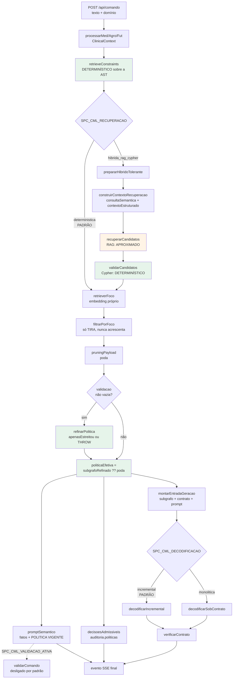
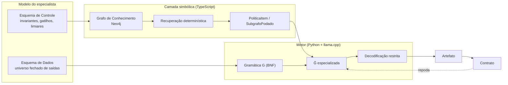
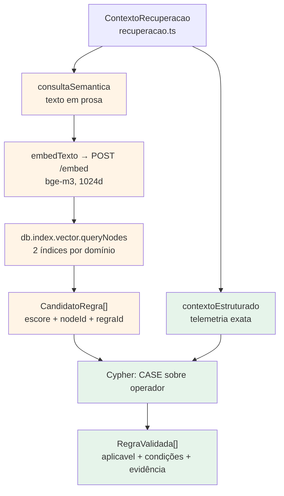
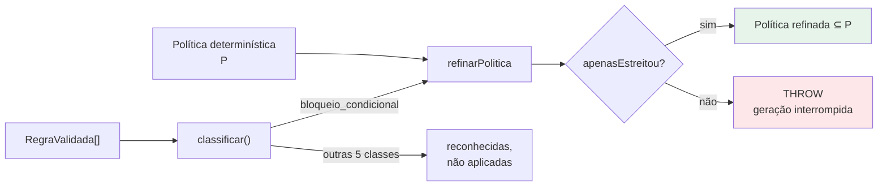
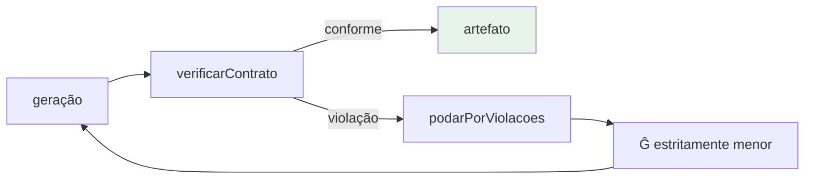

# SPC-CML — Compilador Semântico de Prompts

Middleware neuro-simbólico que interpõe uma **DSL formal**, um **Grafo de Conhecimento** e **decodificação restrita por gramática** entre a fala de um profissional e a ordem que um sistema crítico executa.

**Domínios instanciados:** terapia intensiva (`med`), pulverização aérea por drone (`agro`) e arbitragem de futebol (`fut`). A mesma maquinaria serve aos três; só os modelos do especialista mudam.

O problema que a arquitetura ataca é específico. Um LLM que traduz *"a pressão tá despencando, sobe a nora e aprofunda o propofol"* em uma ordem de bomba erra de duas maneiras distintas, que exigem remédios distintos:

| Tipo de erro | Exemplo | Mecanismo que o elimina |
|---|---|---|
| **Sintático** | emitir `dose 0.1 gotas/min`, ou prosa livre em vez da linguagem de ordens | Gramática BNF derivada da DSL + decodificação restrita |
| **Semântico** | aumentar Propofol com PAM 52 mmHg — sintaticamente perfeito, clinicamente perigoso | Grafo de Conhecimento avaliado sobre a telemetria, convertido em gramática |

A tese operacional do projeto é que o segundo pode ser reduzido ao primeiro: **se o grafo determina que aumentar Propofol é proibido agora, essa cadeia é removida da gramática e o decodificador não consegue emiti-la.** O erro semântico deixa de ser algo a detectar depois e passa a ser inexprimível.

> **Sobre este documento.** Ele descreve o que o código faz hoje, verificado contra os arquivos e a suíte de testes (última conferência: 2026-09-24, ver §18). Onde há distância entre a arquitetura pretendida e a implementada, isso está marcado como **PROPOSTA** ou **PARCIAL**. Trechos assim não descrevem comportamento existente.

---

## Índice

1. [Fluxo de execução real](#1-fluxo-de-execução-real)
2. [Arquitetura em camadas](#2-arquitetura-em-camadas)
3. [Os dois esquemas da DSL](#3-os-dois-esquemas-da-dsl)
4. [Recuperação determinística](#4-recuperação-determinística)
5. [Recuperação híbrida: RAG + Cypher](#5-recuperação-híbrida-rag--cypher)
6. [VETA, PROIBE e AJUSTA](#6-veta-proibe-e-ajusta)
7. [Refinamento seguro da política](#7-refinamento-seguro-da-política)
8. [Prompt Semântico](#8-prompt-semântico)
9. [Grammar Prompting e geração restrita](#9-grammar-prompting-e-geração-restrita)
10. [Validação, reparo e contrato](#10-validação-reparo-e-contrato)
11. [Auditoria e rastreabilidade](#11-auditoria-e-rastreabilidade)
12. [Política por Item (PI)](#12-política-por-item-pi)
13. [Modos de execução](#13-modos-de-execução)
14. [API e endpoints](#14-api-e-endpoints)
15. [Variáveis de ambiente](#15-variáveis-de-ambiente)
16. [Instalação](#16-instalação)
17. [Como rodar](#17-como-rodar)
18. [Testes](#18-testes)
19. [Mapa de rastreabilidade](#19-mapa-de-rastreabilidade)
20. [Limitações e divergências conhecidas](#20-limitações-e-divergências-conhecidas)
21. [Referências](#21-referências)

---

## 1. Fluxo de execução real

Esta é a seção central do documento: o que efetivamente acontece quando uma entrada percorre o sistema. Cada passo indica arquivo, função, entrada, saída e se a decisão é **determinística** (comparação numérica ou estrutural) ou **generativa** (LLM).

O caminho descrito é o do servidor web, que é o pipeline produtivo. Os outros pontos de entrada (§13) montam o cenário por conta própria e reaproveitam só parte do caminho: a CLI, os passos 3, 6 (sem sinal vetorial), 7, 8, 12 e 13; os clientes de lote, 3, 8, 12 e 13, sem foco. Nenhum deles passa pelo modo híbrido (5, 9) nem pela política efetiva do servidor (10).

Os passos 3 a 10 (menos o 4, que só lê a variável) rodam dentro de uma função só, [`recuperarConhecimento`](src/inference/recuperacao-conhecimento.ts), que `processarMed`, `processarAgro` e `processarFut` chamam com o adaptador do domínio (`ADAPTADOR_MED|AGRO|FUT`). Ela foi extraída do bloco que os três repetiam, sem mudar comportamento: `test:recuperacao-conhecimento` roda o bloco antigo e a função lado a lado e exige saída idêntica.

### 1.1 Passo a passo

```text
 1. ENTRADA HTTP                                                 [obrigatório]
    arquivo:  src/web/server.ts
    rota:     POST /api/comando  (resposta em SSE)
    entrada:  { dominio: 'med'|'agro'|'fut', texto: string, contexto?: {...} }
    saída:    despacha para processarMed | processarAgro | processarFut
         ↓
 2. MONTAGEM DO CENÁRIO                                          [obrigatório]
    arquivo:  src/web/server.ts
    função:   processarMed(texto, estagio, contextoForcado?)
    entrada:  texto + contexto do lote, OU sorteio de
              src/examples/med/pacientes.jsonl + telemetrias.jsonl
    saída:    ClinicalContext { telemetria, paciente, populacoes,
                                farmacosEmUso, intencao }
    decisão:  determinística (leitura de arquivo / sorteio)
         ↓
 3. RECUPERAÇÃO DETERMINÍSTICA                                   [obrigatório]
    arquivo:  src/knowledge/graphrag.ts
    função:   retrieveConstraints(model, contexto)
    entrada:  AST da DSL (uti.dsl) + ClinicalContext
    saída:    RetrievedConstraints { protocolosAtivos, bloqueios, vetados,
                                     ajustes, recomendados, escalonamentos,
                                     interacoes, regrasGlobais,
                                     politicas: Map<item,DrugPolicy> }
    decisão:  DETERMINÍSTICA — compara telemetria com limiares da DSL
    nota:     lê a AST do Langium, NÃO o Neo4j
         ↓
 4. ESCOLHA DO MODO                                              [obrigatório]
    arquivo:  src/knowledge/recuperacao-hibrida.ts
    função:   modoRecuperacao()
    entrada:  SPC_CML_RECUPERACAO
    saída:    'deterministica' (PADRÃO) | 'hibrida_rag_cypher'
         ↓
 5. PREPARO HÍBRIDO                                  [condicional: só híbrido]
    arquivo:  src/knowledge/recuperacao-hibrida.ts
    função:   prepararHibridoTolerante(dominio, contexto, session)
    ├─ 5a. construirContextoRecuperacao()        src/knowledge/recuperacao.ts
    │      saída: ContextoRecuperacao { consultaSemantica, contextoEstruturado }
    ├─ 5b. recuperarCandidatos()                 src/knowledge/recuperacao-rag.ts
    │      embedTexto(consultaSemantica) → POST /embed → vetor bge-m3 (1024d)
    │      db.index.vector.queryNodes(2 índices) → CandidatoRegra[] + escore
    │      decisão: APROXIMADA (similaridade de cosseno)
    └─ 5c. validarCandidatos()                   src/knowledge/recuperacao-cypher.ts
           Cypher avalia parametro/operador/limiar → RegraValidada[]
           decisão: DETERMINÍSTICA (CASE sobre o operador, no banco)
    saída:    { sinal: SinalVetorial, validadas: RegraValidada[], auditoria }
    falha:    degrada para o baseline, motivo em auditoria.degradou
         ↓
 6. FOCO SEMÂNTICO                                               [obrigatório]
    arquivo:  src/knowledge/graphrag.ts
    função:   retrieverFoco(session, texto, model, sinal?)
    entrada:  texto + (no híbrido) o sinal vetorial já calculado no passo 5b
    saída:    Foco { farmacos, protocolos, origem }
    decisão:  APROXIMADA — decide o que é MOSTRADO, nunca o que é permitido
    nota:     com `sinal`, NÃO refaz embedding nem busca vetorial
    falha:    embedding ou Neo4j fora → segue com o grafo completo (o passo 7
              não roda), motivo em `focoIndisponivel`
         ↓
 7. FILTRO POR FOCO                                              [obrigatório]
    arquivo:  src/knowledge/graphrag.ts
    função:   filtrarPorFoco(constraints, foco, model, contexto)
    saída:    RetrievedConstraints restrito; políticas RECOMPUTADAS
    invariante: o foco só TIRA decisões admissíveis, nunca acrescenta
         ↓
 8. MONTAGEM DA POLÍTICA (poda)                                  [obrigatório]
    arquivo:  src/knowledge/graphrag.ts → src/knowledge/politica.ts
    função:   poda = pruningPayload(constraints, contexto) → montarSubgrafo(...)
    saída:    SubgrafoPodado { politicas: PoliticaItem[], papeis,
                               constantes, + 3 chaves legadas }
    decisão:  DETERMINÍSTICA
         ↓
 9. REFINAMENTO                             [condicional: validacao não vazia]
    arquivo:  src/knowledge/recuperacao-politica.ts
    função:   refinarPolitica(poda, auditoriaRecuperacao.validacao)
    ├─ classificar(regra) → 6 classes; só `bloqueio_condicional` refina
    ├─ agruparPorItem(validadas)
    └─ apenasEstreitou(poda, refinado) → THROW se ampliou (fail-closed)
    saída:    ReconciliacaoPolitica { subgrafo, ajustes, divergencias, concordam }
              → subgrafoRefinado = rec.subgrafo
              → auditoriaRecuperacao.reconciliacaoPolitica (sem o subgrafo)
    decisão:  DETERMINÍSTICA
    nota:     `validacao` só tem regras no modo híbrido que não degradou. No
              determinístico (padrão), ou se o híbrido degradou, este passo
              não roda e `subgrafoRefinado` fica indefinido
         ↓
10. POLÍTICA EFETIVA                                             [obrigatório]
    arquivo:  src/inference/recuperacao-conhecimento.ts
    função:   recuperarConhecimento (chamada por processarMed | processarAgro
              | processarFut em src/web/server.ts)
    código:   politicaEfetiva = subgrafoRefinado ?? poda
    uso:      calculada UMA vez por requisição; a MESMA variável alimenta
    ├─ auditoriaRecuperacao.politicas ← { item, decisoes, bloqueado } por item
    ├─ promptSemantico = montarPromptSemantico(constraints, contexto,
    │                                          politicaEfetiva)
    ├─ gerarPlanoRestrito(contexto, constraints, model, politicaEfetiva) → 12
    └─ decisoesAdmissiveis = politicaEfetiva.acoes_permitidas
    idem:     montarPromptSemanticoAgro|Fut, gerarMissaoRestrita,
              gerarArbitragemRestrita
    decisão:  DETERMINÍSTICA (escolha estrutural, sem LLM)
         ↓
11. VALIDAÇÃO DO COMANDO           [condicional: SPC_CML_VALIDACAO_ATIVA=true]
    arquivo:  src/web/server.ts
    função:   validarComando(texto, promptSemantico, motor)
              → POST /validar-comando
    saída:    { compreensivel, motivo }; se recusado, o evento `final` sai com
              aceito: false, sem decisoesAdmissiveis nem auditoriaRecuperacao,
              e a geração NÃO acontece
    decisão:  GENERATIVA (LLM sob gramática fixa)
    padrão:   desligada
         ↓
12. ENTRADA DA GERAÇÃO                                           [obrigatório]
    arquivo:  src/inference/llm-client.ts  (idem agro-client.ts, fut-client.ts)
    função:   montarEntradaGeracao(contexto, constraints, model, subgrafoRefinado?)
              — o servidor passa `politicaEfetiva` como 4º argumento
    ├─ subgrafo = subgrafoRefinado ?? pruningPayload(constraints, contexto)
    │     servidor: sempre `politicaEfetiva` — a poda interna NÃO roda
    │     CLI/lote: argumento ausente — a poda determinística é feita aqui
    ├─ contrato = montarContrato(subgrafo, condutasPorDecisaoMed(model),
    │                            escalonamentos, esquemaDeDadosMed(model))
    └─ prompt   = montarPromptSemantico(constraints, contexto, subgrafo)
    saída:    OpcoesDecodificacao { comando, contexto: prompt, subgrafo,
                                    contrato, endpoint, timeoutMs }
    invariante: prompt, gramática e contrato leem o MESMO subgrafo. No
              servidor, o prompt enviado ao motor é idêntico ao
              `promptSemantico` da resposta (mesma função pura, mesmas entradas)
         ↓
13. DECODIFICAÇÃO                                                [obrigatório]
    arquivo:  src/inference/decodificacao.ts
    função:   decodificar(opts) → SPC_CML_DECODIFICACAO
    ├─ 'incremental' (PADRÃO) → decodificarIncremental
    └─ 'monolitica'           → decodificarSobContrato
         ↓
14. RESULTADO
    interno:  ResultadoDecodificacao { resultado, valido, erro, regras_em_g_hat,
                                       …, violacoes, conforme, tentativas,
                                       historico }
    API:      evento SSE `final` com resultado, valido, erroMotor, regrasEmGHat,
              promptSemantico, decisoesAdmissiveis e auditoriaRecuperacao
    nota:     violacoes, conforme, tentativas e historico NÃO saem na API (§14)
```

### 1.2 Passo 13a — decodificação incremental (padrão)

```text
decodificarIncremental()            src/inference/decodificacao.ts

 a. identificador   POST /generate-fragment, símbolo `identificador`
 b. sequência       até MAX_CONDUTAS posições; por posição até 3 tentativas
                    restringirACondutas(subgrafo, condutasRealizaveis(...))
                    verificarConduta() reprova → conduta sai da gramática do retry
 c. cláusulas       UMA por conduta aceita, na ordem da sequência
                    restringirADecisoes(subgrafo, decisoesDaConduta, itensJaUsados)
                    lerClausula() → verificarClausulaNova()
                    violação → podarPorViolacoes() → gramática do retry é MENOR
 d. alertas         até MAX_ALERTAS
 e. montarArtefato()  src/knowledge/contrato.ts
 f. verificarContrato()  veredito final
```

Cada fragmento é gerado sob a gramática que as validações anteriores deixaram de pé. O prefixo enviado ao motor é o artefato parcial — cabeçalho + sequência + cláusulas já aceitas.

### 1.3 Passo 13b — decodificação monolítica

```text
decodificarSobContrato()            src/inference/decodificacao.ts

 laço até MAX_TENTATIVAS (3):
   POST /generate-constrained  → artefato inteiro
   verificarContrato()
   conforme? → retorna
   senão     → podarPorViolacoes() → subgrafo estritamente menor → regera
               se a poda não encolheu, injeta relatorioDeViolacoes() no prompt
```

### 1.4 Diagrama do fluxo


```mermaid
flowchart TD
    A["POST /api/comando<br/>texto + domínio"] --> B["processarMed/Agro/Fut<br/>ClinicalContext"]
    B --> C["retrieveConstraints<br/>DETERMINÍSTICO sobre a AST"]
    C --> M{"SPC_CML_RECUPERACAO"}

    M -->|deterministica<br/>PADRÃO| F["retrieverFoco<br/>embedding próprio"]
    M -->|hibrida_rag_cypher| H["prepararHibridoTolerante"]

    H --> H1["construirContextoRecuperacao<br/>consultaSemantica + contextoEstruturado"]
    H1 --> H2["recuperarCandidatos<br/>RAG: APROXIMADO"]
    H2 --> H3["validarCandidatos<br/>Cypher: DETERMINÍSTICO"]
    H3 --> F

    F --> G["filtrarPorFoco<br/>só TIRA, nunca acrescenta"]
    G --> P["pruningPayload<br/>poda"]
    P --> R{"validacao<br/>não vazia?"}
    R -->|sim| RF["refinarPolitica<br/>apenasEstreitou ou THROW"]
    R -->|não| PE["politicaEfetiva =<br/>subgrafoRefinado ?? poda"]
    RF --> PE

    PE --> PS["promptSemantico<br/>fatos + POLITICA VIGENTE"]
    PE --> API["decisoesAdmissiveis<br/>auditoria.politicas"]
    PE --> E["montarEntradaGeracao<br/>subgrafo + contrato + prompt"]
    PS -.->|SPC_CML_VALIDACAO_ATIVA| VC["validarComando<br/>desligado por padrão"]
    E --> D{"SPC_CML_DECODIFICACAO"}
    D -->|incremental<br/>PADRÃO| I["decodificarIncremental"]
    D -->|monolitica| MO["decodificarSobContrato"]
    I --> V["verificarContrato"]
    MO --> V
    V --> Z["evento SSE final"]
    PS --> Z
    API --> Z

    style H2 fill:#fff4e6
    style C fill:#e6f4ea
    style H3 fill:#e6f4ea
    style RF fill:#e6f4ea
    style PE fill:#e6f4ea
```

Verde = determinístico. Laranja = aproximado. Tudo que sai de `politicaEfetiva` lê o mesmo objeto (§14).

---

## 2. Arquitetura em camadas


```mermaid
flowchart LR
    subgraph DSL["Modelo do especialista"]
        EC["Esquema de Controle<br/>invariantes, gatilhos, limiares"]
        ED["Esquema de Dados<br/>universo fechado de saídas"]
    end
    subgraph SIM["Camada simbólica (TypeScript)"]
        KG["Grafo de Conhecimento<br/>Neo4j"]
        RD["Recuperação determinística"]
        POL["PoliticaItem / SubgrafoPodado"]
    end
    subgraph GEN["Motor (Python + llama.cpp)"]
        G["Gramática G (BNF)"]
        GH["Ĝ especializada"]
        DEC["Decodificação restrita"]
    end
    EC --> KG --> RD --> POL --> GH
    ED --> G --> GH --> DEC
    DEC --> ART["Artefato"] --> CT["Contrato"]
    CT -.->|repoda| GH
```

**Toda decisão de segurança acontece na camada simbólica.** O motor apenas não consegue emitir o que a gramática não gera.

### Separação de responsabilidades

| Camada | Decide | Natureza |
|---|---|---|
| Foco semântico / RAG | o que é **mostrado** | aproximada |
| Recuperação determinística | o que é **permitido** | determinística |
| Especialização de Ĝ | o que é **exprimível** | determinística |
| Contrato do artefato | o que é **coerente** | determinística |

---

## 3. Os dois esquemas da DSL

A DSL (Langium) é a fonte única de verdade e se parte em dois.

**Esquema de Controle** → alimenta o Grafo de Conhecimento: fármacos, protocolos, populações, invariantes de segurança, gatilhos, limiares, interações.

**Esquema de Dados** → alimenta a gramática: o universo fechado de decisões, vias/meios, unidades e condutas que uma saída pode conter.

| domínio | modelo | gramática gerada | símbolo inicial |
|---|---|---|---|
| `med` | [src/examples/med/uti.dsl](src/examples/med/uti.dsl) | `grammar/advanced_icu.bnf` | `plano` |
| `agro` | [src/examples/agro/lavoura.agro](src/examples/agro/lavoura.agro) | `grammar/agro_drone.bnf` | `missao` |
| `fut` | [src/examples/fut/futebol.fut](src/examples/fut/futebol.fut) | `grammar/futebol.bnf` | `arbitragem` |

A BNF é **gerada**, nunca editada à mão — [src/cli/export-bnf.ts](src/cli/export-bnf.ts) e irmãos.

### `PoliticaItem` — a unidade normativa

Definida em [src/knowledge/politica.ts](src/knowledge/politica.ts):

```ts
interface PoliticaItem {
    item: string;              // fármaco | produto | infração
    decisoes: string[];        // o que se pode decidir sobre ele
    meios: string[];           // via | modo | reinício
    unidades: string[];
    valores: ValorAdmissivel[];              // retículo derivado do modelo
    valoresPorDecisao?: Record<string, ValorAdmissivel[]>;  // mais estrito
    bloqueado: boolean;
    motivos: string[];         // justificativas legíveis
}
```

`valoresPorDecisao` é mais estrito que `valores`: o degrau de titulação vale para AUMENTAR, a dose inicial para INICIAR, zero para o que não movimenta a bomba.

---

## 4. Recuperação determinística

[`retrieveConstraints`](src/knowledge/graphrag.ts) (e `retrieveAgroConstraints`, `retrieveFutConstraints`) percorre a **AST da DSL** — não o Neo4j — e compara a telemetria com os limiares declarados.

A política de cada item nasce **aberta** (todas as decisões do `esquema_dados`) e é estreitada por:

1. **estado de curso** (`aplicarEstadoDeCurso`) — não se inicia o que já está em curso;
2. **invariantes** (`BlockRule`) — retiram as decisões de incremento;
3. **vetos** — reduzem às decisões de retirada;
4. **ajustes renais** com ação `suspender`/`bloquear` — retiram incrementos;
5. **ajustes por fator** — reescalam o retículo de valores (§6).

Regras cujo parâmetro não está na telemetria são **ignoradas**: ausência de medida não é evidência de normalidade, mas também não autoriza bloquear.

---

## 5. Recuperação híbrida: RAG + Cypher

> **Padrão: desligado.** `SPC_CML_RECUPERACAO=deterministica`. O modo híbrido é experimental e se ativa com `hibrida_rag_cypher`.


```mermaid
flowchart TD
    CTX["ContextoRecuperacao<br/>recuperacao.ts"] --> SQ["consultaSemantica<br/>texto em prosa"]
    CTX --> SC["contextoEstruturado<br/>telemetria exata"]
    SQ --> EMB["embedTexto → POST /embed<br/>bge-m3, 1024d"]
    EMB --> VS["db.index.vector.queryNodes<br/>2 índices por domínio"]
    VS --> CAND["CandidatoRegra[]<br/>escore + nodeId + regraId"]
    CAND --> CY["Cypher: CASE sobre operador"]
    SC --> CY
    CY --> RV["RegraValidada[]<br/>aplicavel + condições + evidência"]

    style SQ fill:#fff4e6
    style EMB fill:#fff4e6
    style VS fill:#fff4e6
    style CAND fill:#fff4e6
    style SC fill:#e6f4ea
    style CY fill:#e6f4ea
    style RV fill:#e6f4ea
```

### 5.1 Contexto de recuperação

[`construirContextoRecuperacao`](src/knowledge/recuperacao.ts) é uma **projeção** do contexto do pipeline — não uma nova fonte de verdade. Ele separa duas representações da mesma entrada:

| | consulta semântica | contexto estruturado |
|---|---|---|
| destino | embedding / índice vetorial | Cypher / comparação numérica |
| forma | prosa | valores exatos |
| PAM 52 | `"... Sinais do paciente: PAM 52"` | `{ PAM: 52 }` (number) |
| ID do sujeito | **excluído** (ID interno, ruído) | `sujeito: 'PT-2026-0031'` |

**A consulta semântica não substitui a telemetria estruturada.** Ela cita o número; quem o compara com o limiar é o Cypher.

Composição da consulta (`montarConsultaSemantica`), por segmentos fixos: fala do usuário → ambiente do domínio → enquadramentos → estado de curso → sinais. Os sinais que o usuário citou pelo nome vêm primeiro; o bloco é limitado por `SPC_CML_RAG_MAX_SINAIS` (8) para não diluir a intenção.

### 5.2 Índices vetoriais

Seis índices, dois por domínio, todos `cosine`/1024d, criados por `database/neo4j*.ts`:

| domínio | índice de item | label | índice de contexto | label |
|---|---|---|---|---|
| med | `farmaco_embedding` | `Farmaco` | `protocolo_embedding` | `Protocolo` |
| agro | `produto_embedding` | `Produto` | `cultura_embedding` | `Cultura` |
| fut | `infracao_embedding` | `Infracao` | `lance_embedding` | `Lance` |

`topK` (`SPC_CML_RAG_TOP_K`, padrão 10) é **por índice**, sem teto global — um corte global deixaria uma família de nós silenciar a outra, o que seria o RAG decidindo.

### 5.3 O escore não é validade

```
escore = RELEVÂNCIA SEMÂNTICA da recuperação

escore NÃO é validade.   escore NÃO é autorização.
escore mais alto NÃO é "a regra escolhida".
```

Auditado em [recuperacao-rag.ts](src/knowledge/recuperacao-rag.ts): as únicas operações sobre `escore` são carregar adiante, reconstruir do cosseno quando ausente, e ordenar para apresentação. Nenhuma comparação, nenhum limiar, nenhum filtro.

### 5.4 Validação por Cypher

[`recuperacao-cypher.ts`](src/knowledge/recuperacao-cypher.ts) executa a comparação **no banco**:

```cypher
MATCH (alvo:`Farmaco` { nome: $nome })
MATCH (alvo)-[rel]-(regra)
WHERE regra.parametro IS NOT NULL
WITH regra, rel, coalesce(regra.limiar, regra.valor) AS esperado,
     $telemetria[regra.parametro] AS observado
RETURN ..., CASE WHEN observado IS NULL THEN NULL
                 WHEN regra.operador = '<' THEN observado < esperado
                 ... END AS satisfeita
```

O filtro `parametro IS NOT NULL` seleciona exatamente cinco tipos de nó:

| tipo | dono | campo do valor | relação |
|---|---|---|---|
| `RegraSeguranca` | item | `limiar` | `BLOQUEIA_INCREMENTO` \| `BLOQUEIA` |
| `AjusteRenal` | fármaco | `limiar` | `EXIGE_AJUSTE` |
| `Gatilho` | contexto | `valor` | `DISPARA` |
| `Escalonamento` | contexto | `valor` | `ESCALONA` |
| `Limiar` | infração | `valor` | `TEM_LIMIAR` |

**Nós com parâmetro não são toda a política.** Vetos, proibições e ajustes por fator são **arestas sem parâmetro** e nunca aparecem em `RegraValidada[]` — chegam à política por outro caminho determinístico (§6). É por isso que o refinamento estreita em vez de reconstruir.

Quando a telemetria não traz o parâmetro, a condição vira **lacuna**, não falsidade: `aplicavel = false`, `condicoesFalhas` vazio, `lacunas` preenchido.

---

## 6. VETA, PROIBE e AJUSTA

Verificado no grafo e no código:

| relação | de → para | propriedades | transformação na política | depende de |
|---|---|---|---|---|
| `VETA` | Protocolo/Cultura/Lance → item | `motivo` | `decisoes = filter(DECISOES_DE_RETIRADA)`, `bloqueado = true` | item + **contexto em foco** |
| `PROIBE` | Populacao/Area/Contexto → item | `motivo` | idem | item + **estado do sujeito** |
| `AJUSTA` | Populacao/Area/Contexto → item | `motivo`, **`fator`** | **`escalar(valores, fator)` + `escalarMapa(valoresPorDecisao, fator)`** | item + estado |

Três consequências:

**`AJUSTA` não remove decisão alguma.** Ele reescala o retículo de valores por um fator (0.5, 0.75 no modelo clínico). Descrevê-lo como remoção de decisões seria descrever outra coisa.

**`VETA` depende do foco**; `filtrarPorFoco` só mantém vetos cujo protocolo está em foco. **`PROIBE` depende do estado do sujeito** (população/área), que vem do contexto — ausência de recuperação semântica nunca pode revogá-lo.

**Nenhuma das três é visível ao Cypher de validação**, porque nenhuma é nó com `parametro`.

---

## 7. Refinamento seguro da política

[`recuperacao-politica.ts`](src/knowledge/recuperacao-politica.ts). O refinamento **estreita** a política determinística; nunca a reconstrói.

### 7.1 `classificar()` — seis classes

| classe | origem | refina a política? |
|---|---|---|
| `bloqueio_condicional` | `BLOQUEIA`/`BLOQUEIA_INCREMENTO`, ou `EXIGE_AJUSTE` com ação `suspender`/`bloquear` | **SIM** |
| `ativacao_de_contexto` | `DISPARA`, `EXIGE_AJUSTE` com outra ação | não |
| `escalonamento` | `ESCALONA` | não |
| `sancao` | `TEM_LIMIAR` | não |
| `nao_incidente` | regra cujas condições são falsas | não |
| `sem_evidencia` | parâmetro não medido | não |

Só a primeira altera a política. As outras cinco existem para registrar que foram **reconhecidas e deliberadamente não aplicadas** — não esquecidas.

### 7.2 `refinarPolitica()` e a não-ampliação

```
Política refinada ⊆ Política determinística
```

Verificado por `apenasEstreitou(antes, depois)` sobre **itens e decisões**: nenhum item novo, nenhuma decisão que não estivesse na política original. A garantia roda **em runtime**, não só em teste:

```ts
if (!apenasEstreitou(subgrafo, refinado)) {
    throw new Error('refinamento da politica ampliou permissoes: ...');
}
```

**Fail-closed:** a exceção sobe até o handler SSE e a geração não acontece. Não há fallback silencioso para a política mais ampla.

Os testes verificam adicionalmente que **meios** e **valores** também não crescem ([recuperacao-politica.test.ts](src/test/recuperacao-politica.test.ts), TESTE 16).

**Onde roda e para onde vai.** Só no caminho do servidor (`recuperarConhecimento`, §1), e só quando `auditoriaRecuperacao.validacao` não está vazia — na prática, no modo híbrido sem degradação. O `rec.subgrafo` vira `subgrafoRefinado` e, por meio de `politicaEfetiva` (§1, passo 10), é a política que chega ao prompt, à gramática, ao contrato e à resposta da API. `montarEntradaGeracao*` não repete `apenasEstreitou`: a checagem fica em `refinarPolitica`, o único ponto que tem as duas políticas em mãos. O teste 13 de `test:geracao` verifica que uma decisão retirada pelo refinamento não chega ao gerador nem ao contrato.

### 7.3 Lista vazia ≠ ausência de permissões

`RegraValidada[] = []` significa **"o RAG nada acrescentou"**, não **"nada é permitido"**. A política determinística passa intacta. Interpretar silêncio como proibição daria ao RAG poder de veto por omissão — exatamente o que a arquitetura proíbe.

No servidor, a lista vazia nem chega a chamar `refinarPolitica`: `politicaEfetiva` é a própria poda. Chamada diretamente com `[]`, `refinarPolitica` devolve a poda inalterada (`test:politica`, TESTE 9; `test:geracao`, teste 12).

### 7.4 Divergências

Regras restritivas que incidem sobre item **ausente da política** são registradas como divergência sem alterar nada. A causa mais comum **não é defeito**: é o foco. Medido no cenário de referência, `plaquetas 45 < 50` incide sobre Heparina, que o foco não trouxe. Isso difere de uma regra incidente sobre item **em foco**, que refina de fato.


```mermaid
flowchart LR
    P["Política determinística<br/>P"] --> R["refinarPolitica"]
    V["RegraValidada[]"] --> CL["classificar()"]
    CL -->|bloqueio_condicional| R
    CL -->|outras 5 classes| IG["reconhecidas,<br/>não aplicadas"]
    R --> CK{"apenasEstreitou?"}
    CK -->|sim| PR["Política refinada ⊆ P"]
    CK -->|não| TH["THROW<br/>geração interrompida"]
    style TH fill:#fde7e9
    style PR fill:#e6f4ea
```

---

## 8. Prompt Semântico

[`montarPromptSemantico`](src/inference/llm-client.ts) e irmãos montam o bloco factual que o LLM lê. Cada linha saiu de uma comparação numérica, não de suposição.

Blocos factuais, nesta ordem (nomes do domínio `med`; `agro` e `fut` têm equivalentes próprios): `[CENARIO]`, `[PROTOCOLOS EM FOCO]`, `[INCREMENTOS BLOQUEADOS — invariantes de seguranca]`, `[FARMACOS VETADOS NESTE CONTEXTO]`, `[AJUSTES DE DOSE EXIGIDOS]`, `[ESCALONAMENTOS DISPARADOS]`, `[INTERACOES ENTRE FARMACOS EM USO]`, `[RECOMENDADOS PELO PROTOCOLO]`, `[INVARIANTES GLOBAIS]`. `[CENARIO]` só aparece quando o contexto é passado; os demais somem quando vazios, exceto `[INVARIANTES GLOBAIS]`.

### A política vigente no prompt

`montarPromptSemantico*` aceita um terceiro parâmetro opcional: a política efetivamente vigente, um `SubgrafoPodado`. No caminho de geração ele vem **sempre, nos dois modos de recuperação**. `montarEntradaGeracao*` repassa o mesmo `subgrafo` que vira gramática e contrato, e o servidor monta o `promptSemantico` da resposta com `politicaEfetiva` (§1, passos 10 e 12). No modo determinístico, que é o padrão, essa política é a poda. No híbrido com regras validadas, é a refinada.

Com o parâmetro, acontecem duas coisas.

**1. Recomendações são anotadas, nunca apagadas.** Que o protocolo recomende um item continua sendo um fato do domínio; apagá-lo empobreceria o contexto que o modelo usa para justificar a decisão. `anotarRecomendacao` acrescenta, **na mesma linha**, a informação que faltava:

| situação do item na política vigente | anotação |
|---|---|
| presente e admite alguma decisão de incremento (`papeis.decisoesDeIncremento`) | nenhuma |
| presente, sem nenhuma decisão de incremento | `(recomendado, mas sem decisao de incremento admissivel agora)` |
| ausente (em geral porque o foco não o trouxe) | `(fora da politica vigente neste cenario)` |

**2. Um bloco de autoridade fecha o prompt.** `blocoPoliticaEfetiva` lista cada item com as decisões que restaram e marca `[RESTRITO]` os bloqueados, repetindo os `motivos` só para esses. Fatos primeiro, o que se pode decidir por último. Item sem decisão sai como `(nenhuma decisao admissivel)`; política sem itens não gera bloco.

Saída real, no modo determinístico, para o cenário de referência de [llm-client.ts](src/inference/llm-client.ts) (PT-2026-0031: PAM 52, FC 145; Noradrenalina, Propofol e Vancomicina em curso), sobre o grafo completo, sem o filtro de foco. Trechos:

```
[RECOMENDADOS PELO PROTOCOLO]
- Noradrenalina: vasopressor de primeira linha para PAM < 65 mmHg (Choque_Septico) (recomendado, mas sem decisao de incremento admissivel agora)
- Vasopressina: segunda linha poupadora de catecolamina (Choque_Septico)
...
[POLITICA VIGENTE — o que e exprimivel neste cenario]
(esta lista e a autoridade: a gramatica so gera o que esta aqui)
- Noradrenalina [RESTRITO]: REDUZIR_VAZAO, MANTER_VAZAO, MANTER_BLOQUEADO, SUSPENDER, SUBSTITUIR, SOLICITAR_EXAME, ESCALAR_EQUIPE, BLOQUEAR_ORDEM
    motivo: ja em curso: nao cabe iniciar de novo
    motivo: incremento bloqueado (FC 145 > 130 bpm): risco de taquiarritmia e fibrilacao atrial
- Adrenalina: INICIAR_INFUSAO, MANTER_BLOQUEADO, SUBSTITUIR, SOLICITAR_EXAME, ESCALAR_EQUIPE, BLOQUEAR_ORDEM
...
- Propofol [RESTRITO]: REDUZIR_VAZAO, MANTER_VAZAO, MANTER_BLOQUEADO, SUSPENDER, SUBSTITUIR, SOLICITAR_EXAME, ESCALAR_EQUIPE, BLOQUEAR_ORDEM
    motivo: ja em curso: nao cabe iniciar de novo
    motivo: incremento bloqueado (PAM 52 < 60 mmHg): risco de hipotensao severa e colapso hemodinamico
```

Quando o refinamento estreita um item, o motivo que ele acrescenta vem no formato de `refinarPolitica`, `<tipo> (<parâmetro> <observado> <exigido>): <razão>`, em vez do `incremento bloqueado (...)` da recuperação determinística.

**Sem o parâmetro, o prompt sai exatamente como sempre saiu**, sem anotação e sem bloco. Quem ainda chama assim:

| chamador | por quê |
|---|---|
| `scripts/gerar-ground-truth-*.ts` | o gabarito precisa de texto estável |
| exibição no console de `cli.ts`, dos clientes de lote, de `inspecionar-foco.ts` e do `main()` de `llm-client.ts` | só log |

> ⚠️ A CLI e os clientes de lote **imprimem** o prompt legado, mas o que **enviam** ao motor (via `gerar*Restrito` → `montarEntradaGeracao*`) traz a anotação e o bloco, montados com a poda. O log do console não é o texto que o LLM leu.

Helpers em [politica.ts](src/knowledge/politica.ts): `blocoPoliticaEfetiva`, `anotarRecomendacao`, `admiteIncremento`, todos agnósticos de domínio, via `papeis`. Cobertos por `test:geracao` (7 casos no bloco "o Prompt Semantico reflete a politica vigente").

---

## 9. Grammar Prompting e geração restrita

### 9.1 De G para Ĝ

[`grammar_from_kg.py`](src/python_engine/grammar_from_kg.py), quatro fases:

**Fase 0 — `especializar_por_item`.** Reescreve a regra da cláusula em uma produção **por item**, cada uma com as decisões, meios e valores daquele item. Sem ela, `ordem ::= "ordem" farmaco "decisao" decisao ...` é um produto cartesiano e basta um item admitir `INICIAR_INFUSAO` para todos admitirem.

Fixa também como literais o que é **dado** do cenário: sujeito e contextos.

**Fases 1–3.** Poda dos vocabulários fechados (`MAPA_PODA`), remoção de símbolos não geradores, varredura de alcance a partir do símbolo inicial.

### 9.2 Decodificação restrita

Backend padrão `llamacpp`: a Ĝ vira GBNF (`to_gbnf`) e o llama.cpp mascara logits em C++. O backend `outlines` existe para comparação de desempenho — reconstrói um FSM sobre todo o vocabulário a cada terminal, o que nesta gramática não termina em tempo útil.

Chamadas ao llama.cpp são serializadas por `_LLAMA_LOCK` (RLock) em [main.py](src/python_engine/main.py).

---

## 10. Validação, reparo e contrato

| nível | onde | o que verifica |
|---|---|---|
| **Sintática** | `/generate-constrained` reparseia com Lark | pertence a L(Ĝ)? |
| **Sintática (cliente)** | `lerArtefato` / `lerClausula` por regex | os campos são legíveis? |
| **Semântica local** | `verificarClausulas` | item na poda, decisão admissível, meio, valor no retículo |
| **Relacional** | `verificarClausulas` acumulado | unicidade por item |
| **Global** | `verificarArtefato` | sequência ↔ cláusulas, escalonamento coberto, sujeito, contexto, artefato vazio |

> ⚠️ **`/generate-fragment` NÃO reparseia o fragmento.** A garantia sintática ali vem apenas da máscara GBNF; no cliente, a leitura é por regex. Só o caminho monolítico reparseia.

### Reparo

`podarPorViolacoes(subgrafo, violacoes)` devolve um subgrafo **estritamente menor**: o par (item, decisão) que falhou sai da política e, com ele, da gramática. A tentativa seguinte não consegue repetir o erro.


```mermaid
flowchart LR
    G["geração"] --> VC["verificarContrato"]
    VC -->|conforme| OK["artefato"]
    VC -->|violação| PV["podarPorViolacoes"]
    PV --> GH["Ĝ estritamente menor"]
    GH --> G
    style OK fill:#e6f4ea
```

### Avaliação dos planos já gerados (`/api/avaliar`): sintaxe → AST → (semântica → oráculo ‖ LLM Judge) → comparação

A tela "Avaliar resultados" passa cada plano do lote por uma **cascata**, e cada camada responde uma pergunta diferente ([avaliar-sintaxe.ts](src/inference/avaliar-sintaxe.ts), [avaliar-grafo.ts](src/inference/avaliar-grafo.ts)):

| camada | pergunta | como |
|---|---|---|
| **1. Sintaxe** | o texto pertence à DSL? | **G** — `/verify` com subgrafo vazio, que reparseia contra a BNF completa (a mesma que a decodificação mascara) — **e** o parser Langium da DSL, com a ligação de referências contra o modelo do especialista. VALID só se as duas peças aceitam (`pecas` diz o que cada uma disse). Erros com o código do próprio parser (classes do Lark, `lexing-error`/`parsing-error`/`linking-error` do Langium), fonte, linha, coluna, regra ou campo, encontrado e esperado |
| **AST** | — | o AST **oficial** (`PlanCommand` \| `MissionCommand` \| `DecisionCommand`), serializado pelo `JsonSerializer` do Langium, com `$literal` em cada quantidade (o número como está no texto). É o objeto guardado no resultado **e** o único que a semântica lê (`projetarAst`) |
| **2. Semântica** | dado o AST, o plano respeita política, conhecimento, telemetria, pedido, contrato e relações? | sem texto nenhum (o plano composto julgado tem `texto` vazio), com a recuperação da geração refeita a partir do `sorteio` do registro, os validadores do multiagente na ordem dele: `/verify` com a política efetiva (L(Ĝ)), `validarSequencia`, `decomporPIs` + `validarPI`, `validarPlanoGlobal` (contrato por `verificarLido`). Nenhum critério novo |
| **3. Oráculo** | o plano é válido no SPC-CML? | sintaxe INVALID → INVALID (origem: sintaxe); senão o veredito da semântica (origem: semântica). É o resultado **normativo** |
| **4. LLM Judge** | um LLM independente acha o plano adequado? | **experimental**: `/validar-plano` ([julgamento.py](src/python_engine/julgamento.py)). Avalia todo plano com AST — também os semanticamente INVALID ou UNRESOLVED —; texto fora da DSL só com `SPC_CML_AVALIAR_JULGAR_SINTAXE_INVALIDA=true`; artefato vazio nunca. `status`: `VALID` \| `INVALID` \| `UNRESOLVED` \| `NOT_CALLED` \| `NO_RESPONSE` |

**Fluxo e concorrência.** Oráculo e LLM Judge são independentes e são executados concorrentemente após a obtenção de um AST sintaticamente válido:

```
TEXTO → SINTAXE → AST ─┬─→ SEMÂNTICA → ORÁCULO ─┐
                       │                         ├─→ COMPARAÇÃO → JSONL/UI
                       └─→ LLM JUDGE ────────────┘
```

Planos sintaticamente inválidos (e o artefato vazio) não são enviados ao Judge (`NOT_CALLED`; a exceção experimental é `SPC_CML_AVALIAR_JULGAR_SINTAXE_INVALIDA`). A sintaxe vem sempre primeiro. A recuperação do conhecimento (grafo) é a única dependência compartilhada além do AST: a semântica e o juiz leem o mesmo conhecimento, então ela roda antes da bifurcação. Em `avaliarPlano` as duas ramificações são iniciadas antes de qualquer `await` (`Promise.allSettled`): o juiz não lê nada da semântica (nem do oráculo), a semântica não espera o juiz, e a comparação só acontece com os dois resultados em mãos. Uma falha não apaga a outra: juiz sem resposta → `NO_RESPONSE` e o oráculo vale; semântica com falha técnica → a linha é `naoAvaliado` (sem veredito normativo), com o motivo, **e o julgamento do juiz é preservado**. Cancelamento propaga. O resultado lógico (AST, semântica, oráculo, juiz, concordância, classificação) é o mesmo da execução em série; só mudam os tempos.

**Tempos.** Cada plano grava `tempos` (ms, `performance.now()`, relógio monotônico): `sintaxeMs`, `recuperacaoMs`, `oraculoMs` (só a validação semântica; `null` se não rodou), `llmJudgeMs` (só a chamada ao juiz; `null` se não foi chamado), `paraleloMs` (o trecho concorrente inteiro) e `totalMs`. Como as duas ramificações são concorrentes, `paraleloMs ≈ max(oraculoMs, llmJudgeMs)` e `totalMs ≈ sintaxeMs + recuperacaoMs + paraleloMs + sobrecarga` — não a soma do oráculo com o juiz. Cada registro do JSONL também repete os totais da avaliação, em segundos: `tempoTotalSegundos` (relógio de parede da avaliação inteira) e as somas por plano `tempoSintaxeSegundos`, `tempoOraculoSegundos`, `tempoLlmJudgeSegundos`. A tela mostra os quatro.

**Precedência.** Texto vazio ou fora da DSL: sintaxe INVALID, semântica `NOT_EVALUATED`, oráculo INVALID, juiz `NOT_CALLED`. DSL válida: semântica e oráculo VALID, INVALID ou UNRESOLVED, e o juiz registrado ao lado. O juiz nunca corrige o oráculo (nem o oráculo o juiz): vereditos iguais → concordantes, com a classificação do oráculo (`VALIDO_PELO_ORACULO`, `INVALIDO_PELO_ORACULO`, `UNRESOLVIDO_PELO_ORACULO`); qualquer combinação diferente → `DISCORDANCIA_LLM`, com o oráculo intacto — UNRESOLVED continua UNRESOLVED. A tela pinta a linha pela cor do oráculo; a discordância é uma marca à parte.

**UNRESOLVED nunca vira INVALID.** Os caminhos, todos dos validadores da geração: política efetiva sem item ou sem mapa decisão → conduta (a semântica para na sequência, como a geração para antes do Planner, e o `/verify` da política nem é chamado); regra que bloquearia um incremento sem a medida (`telemetria_insuficiente`, na sequência, no PI e na global); pedido sem item citado (`pedido_global_indeterminado`); item citado sem decisão que realize conduta alguma, ou escalonamento que obriga uma conduta que nenhum item realiza (`conhecimento_insuficiente`); justificativa obrigatória sem evidência nenhuma no contexto (`evidencia_insuficiente`, no PI). No último caso de escalonamento, o `escalonamento_ignorado` de `validarPlanoGlobal` — que na geração nunca vê esse estado — é reclassificado como lacuna, pelo critério de `validarSequencia` (aviso `escalonamento_irrealizavel`).

**Dependências.** `dependeDe` não está na DSL do artefato: vem da sequência do Planner (`execucaoMultiagente.sequenciaValidada`), que o lote do web-chat passou a gravar. Sem ela, as dependências não são conferidas e os PIs são julgados sem as relações que o Planner declarou — o que muda veredito: a justificativa de um PI que cita o item de que ele depende é `justificativa_referencia_inexistente` sem a sequência, e aceita com ela. Sequência que não corresponde às cláusulas do AST não é usada (aviso `sequencia_nao_corresponde`).

**Estruturado × texto.** A semântica só confere o que tem forma. `regra_global` e o mecanismo/conduta das regras relacionais são texto: aparecem em `naoFormalizado` (e no aviso `regras_globais_textuais`), vão ao juiz como evidência e nunca reprovam nem deixam indeterminado.

Cada avaliação grava `data/avaliacoes/<data>-<dominio>.jsonl` (baixável pela tela, `GET /api/avaliacoes/:arquivo`): um registro por plano, com `validacaoSintatica`, `ast`, `validacaoSemantica` (por etapa), `oraculo`, `julgamentoLLM` (com a resposta bruta), `concordancia` e `classificacao` separados. As métricas contam sintaxe, semântica, oráculo e juiz separadamente, as concordâncias e cada par `oráculo+juiz`. Se o Prompt Semântico reconstruído diferir do gravado na geração, a semântica avisa `contexto_divergente`.

---

## 11. Auditoria e rastreabilidade

`AuditoriaRecuperacao` ([recuperacao-hibrida.ts](src/knowledge/recuperacao-hibrida.ts)) acompanha toda resposta aceita de `/api/comando`, nos dois modos. É preenchida em duas etapas:

| campo | quem preenche | quando |
|---|---|---|
| `id`, `modo`, `dominio`, `intencao` | `auditoriaVazia` ou `prepararHibrido` | sempre |
| `consultaSemantica`, `topK`, `indices`, `telemetria`, `candidatos` (com escore), `validacao` (`RegraValidada[]` estruturado) | `prepararHibrido` | só no híbrido que não degradou; fora dele ficam vazios (`''`, `0`, `[]`, `{}`) |
| `degradou` | `prepararHibridoTolerante` | quando o híbrido falhou e caiu no baseline |
| `foco` | `recuperarConhecimento` | quando o foco foi calculado |
| `politicas` | `recuperarConhecimento`, a partir de `politicaEfetiva` | sempre |
| `reconciliacaoPolitica` | `recuperarConhecimento`, a partir de `refinarPolitica` | só quando `validacao` não está vazia |

`test:rastro` verifica os dez pontos da trilha que `prepararHibrido` produz: id e intenção, consulta semântica, topK e índices, candidato, escore, validação, condições satisfeitas, condições falhas, telemetria e `regraId`. Os três campos que `recuperarConhecimento` preenche são comparados, nos três domínios, com o que o bloco antigo do servidor produzia (`test:recuperacao-conhecimento`); `politicas` também é conferido em `test:geracao`.

**Nunca "regra = aceita" sozinho.** `explicarRegra()` produz uma linha como:

```
Farmaco:Propofol/RegraSeguranca/PAM<60 REJEITADA (escore RAG 0.8244) porque PAM observado 82, exigido < 60 mmHg
```

Leitores: `regrasAceitas`, `regrasRejeitadas`, `regrasSemEvidencia`, `rastrearRegra(auditoria, regraId)`, `relatorioAuditoria`.

A trilha é **metadado de execução**: não entra no artefato, na DSL nem na saída do usuário.

---

## 12. Política por Item (PI)

### 12.1 Estado real

**PARCIAL.** Existe [`src/knowledge/item-geracao.ts`](src/knowledge/item-geracao.ts) com `ContextoGeracaoItem`, `subgrafoDeItem`, `contextosPorItem`, `ordenarPorOrigem` e `itensQueAdmitem`. `ContextoGeracaoItem` é a entrada do PI Agent: além da política, das regras e das evidências, carrega o pedido, a telemetria relevante, os fatos do cenário, as regras relacionais, as decisões admissíveis, bloqueadas e fora da conduta, os valores, as restrições e — quando há Planner — o PI, a conduta declarada e as relações com os outros PIs. O Decompositor (§12.6) o produz, um por PI.

| | estado |
|---|---|
| módulo existe | sim |
| testes | `test:multiagente` (`contextosPorItem`), `test:decompositor` (contexto por PI), `test:pi-agent` (PI Agent) |
| **integrado ao fluxo** | **só no `multiagente`** — o Decompositor monta um contexto por PI, o PI Agent (§12.7) resolve cada um, e a composição e a validação global (§12.8) fecham o plano |
| paralelismo físico | **não** |

Os contratos da arquitetura multiagente também existem: [`contrato-pi.ts`](src/knowledge/contrato-pi.ts) (`PIPlanejado` — o par item/conduta, sem ação — e `ResultadoPI`), [`validacao.ts`](src/knowledge/validacao.ts) (`ResultadoValidacao`: `VALID` | `INVALID` | `UNRESOLVED`) e [`multiagente.ts`](src/inference/multiagente.ts) (status, transições, orçamento de tentativas e contexto da execução). No modo determinístico, `regras` e `telemetriaRelevante` saem vazios: `RegraValidada` só existe no híbrido.

### 12.4 Planner

O primeiro agente cognitivo existe: [`planner.ts`](src/inference/planner.ts), orquestrado por `decodificarMultiagente` ([decodificacao.ts](src/inference/decodificacao.ts)) quando `SPC_CML_DECODIFICACAO=multiagente`.

```text
recuperarConhecimento (servidor) ─► ConhecimentoRecuperado
   └─ montarEntradaGeracao*(…, conhecimento) ─► opts.execucao
decodificarMultiagente
   RECEIVED → KNOWLEDGE_RETRIEVED → SEMANTIC_PROMPT_READY   registrarConhecimento
       alvoDoPedido          nenhum item citado pelo nome → UNRESOLVED (sem Planner, sem ciclo; §12.9)
   → PLANNING                                              contextoPlanner + lacunasDoConhecimento
       montarPromptPlanner   instrução + Prompt Semântico global (inteiro, uma vez) + candidatos
                             [+ FEEDBACK DA VALIDACAO ANTERIOR] + formato
       POST /generate-planner  gramatica_do_planner(itens, condutas, max_pis[, condutas_por_item]) + o mesmo _gerar
   → SEQUENCE_VALIDATING
       lerSaidaPlanner       saída bruta → PIPlanejado[] (sem correção)        fase "protocolo"
       validarSequencia      PIPlanejado[] × conhecimento                        fase "semantica"
         VALID       → SEQUENCE_VALID
         UNRESOLVED  → UNRESOLVED
         INVALID     → feedback + restrição → PLANNING  (guarda: orçamento)   ou UNRESOLVED se esgotou
   → PI_DECOMPOSING                                        decomporSequencia (§12.6), sem modelo
   → PI_DECOMPOSED                                         ctx.contextosPI: um ContextoGeracaoItem por PI
                                                           ctx.planoExecucaoPI: DAG de dependeDe + ondas (§12.10)
   → (PI_EXECUTING → PI_VALIDATING)+                       resolverPIs (§12.7): onda por onda, um PI por vez, retry só do PI
   → PI_ALL_VALID                                          ctx.resultadosPI: um ResultadoPI válido por PI
   → COMPOSING → GLOBAL_VALIDATING                         comporPlano + /verify + validarPlanoGlobal (§12.8)
       VALID       → COMPLETED                             ctx.artefatoFinal = o `resultado`
       UNRESOLVED  → UNRESOLVED
       INVALID     → feedback global → PLANNING (ciclo seguinte), até ciclosGlobais; senão UNRESOLVED
```

- **O Planner escolhe o par (item, conduta), a ordem e as dependências.** Ação, decisão, meio, valor e justificativa são do PI Agent: o prompt proíbe, `PIPlanejado` os tipa como `never`, a gramática não os gera e o parser os recusa.
- **Formato:** `PLANO 1 | Noradrenalina | Titular_Vasopressor | [ ] 2 | Propofol | Manter_Bloqueio | [ 1 ] FIM` — uma linha, porque `to_gbnf` separa todo símbolo por um espaço; o parser aceita o mesmo texto com quebras de linha.
- **Gramática** ([`gramatica_do_planner`](src/python_engine/grammar_from_kg.py)): itens = os da política efetiva com alguma conduta realizável; condutas = `condutasRealizaveis` (o critério da sequência no incremental); posições 1..n em ordem; dependências só para posições anteriores; no máximo `min(SPC_CML_MAX_CONDUTAS, itens)` posições. Na primeira tentativa **não** amarra o par. Depois de um `item_conduta_incompativel`, o item reprovado fica amarrado às condutas que realiza (`condutas_por_item`, restrição progressiva); os demais seguem livres.
- **Leitura sem correção:** item ou conduta fora dos candidatos seguem como vieram, com aviso — o vocabulário é julgado pela validação. Posição fora de ordem, texto livre e markdown são recusados.
- **Só o servidor** monta `opts.execucao`. CLI e lote, com `multiagente`, recebem erro explícito.

### 12.5 Validação da sequência e retry

[`validacao-sequencia.ts`](src/knowledge/validacao-sequencia.ts) é uma camada de orquestração sobre critérios que já existiam:

| verificação | critério reusado | código |
|---|---|---|
| forma, ordem, dependências | `validarSequenciaPlanejada` + posição na lista | `ordem_repetida`, `ordem_fora_de_sequencia`, `ordem_fora_de_posicao`, `dependencia_*` |
| item na política | `contrato.politicas` (como `verificarClausulas`) | `item_fora_da_poda` |
| conduta conhecida | `contrato.condutaPorDecisao` | `conduta_inexistente` |
| conduta realizável | `condutasRealizaveis` | `conduta_nao_realizavel` |
| par (item, conduta) | `decisoesDaConduta` + `restringirADecisoes` | `item_conduta_incompativel` |
| unicidade | `contrato.unicidade` (como `verificarClausulas`) | `item_repetido` |
| obrigatórias | `condutasObrigatorias` (como `verificarArtefato`) | `escalonamento_ignorado` |
| itens citados no pedido | `casamentoLexical` | `cobertura_insuficiente`, `pedido_incompativel`, aviso `cobertura_indeterminada` |
| telemetria sem medida (híbrido) | `classificar` + `Lacuna` do Cypher | UNRESOLVED `telemetria_insuficiente` |
| conhecimento que falta | — | UNRESOLVED `conhecimento_insuficiente` |

- **INVALID** = o conhecimento basta e o plano viola uma regra; **UNRESOLVED** = o conhecimento não basta para decidir. Havendo erro comprovado, INVALID prevalece.
- A telemetria entra pela política: um bloqueio que incide já tirou a decisão do item, e o par aparece incompatível com o motivo (`PAM 52 < 60`) como evidência.
- A mesma conduta para itens diferentes é **permitida** (o contrato do artefato compara conjuntos); `verificarConduta` não é reusada porque proíbe isso por ser uma restrição do algoritmo incremental.
- Nenhuma DSL declara precedência entre itens ou condutas: dependências são conferidas na forma e **nenhuma é inventada**.
- **Retry:** no máximo `SPC_CML_MAX_TENTATIVAS_PLANNER` propostas (padrão 3). Saída fora do protocolo também entra no laço (fase `protocolo`, com feedback próprio). UNRESOLVED não é repetido. Lacunas que não dependem do plano (obrigatória que ninguém realiza, item citado sem conduta) encerram **antes** da primeira chamada.
- **Feedback:** o mesmo prompt base mais a seção `[FEEDBACK DA VALIDACAO ANTERIOR]`, com o plano anterior e, por PI, o erro, a regra, a evidência e o que o conhecimento permite. Só os problemas da tentativa anterior.
- **Estados:** a volta é `SEQUENCE_VALIDATING → PLANNING`, com guarda (`impedimentoDeReplanejar`): só com a última proposta INVALID e orçamento sobrando. `PLANNING → PLANNING` continua proibido.
- **Histórico:** cada tentativa guarda número, prompt, saída bruta, fase, sequência, veredito, métricas (tokens, duração da inferência e da validação, tamanho do feedback) e o feedback que gerou.

### 12.6 Decompositor

[`decompositor.ts`](src/knowledge/decompositor.ts) (`decomporPIs`, `montarPromptPI`, `medirDecomposicao`) e a etapa `decomporSequencia` em [`multiagente.ts`](src/inference/multiagente.ts). Responde **"o que este PI precisa saber?"** — não escolhe item, conduta, decisão, meio, valor nem ordem, e não escreve justificativa. O `PIPlanejado` validado é a autoridade sobre item, conduta, ordem e dependências.

```text
SEQUENCE_VALID ──(guarda: última proposta VALID na fase semântica, e é a sequenciaValidada)──►
PI_DECOMPOSING   decomporPIs(sequenciaValidada, conhecimento da execução)
                   por PI: política do item → restrita às decisões da conduta → o que cita o par
PI_DECOMPOSED ◄──(guarda: um contexto por PI, mesma ordem, mesmo par)
```

| o que o PI recebe | como é selecionado (sempre por estrutura) |
|---|---|
| identidade | `pi` (cópia do `PIPlanejado`), `metadata.requestId`, `dominio`, `ordemOriginal = ordem − 1` |
| decisões | `admissiveis` = `item.decisoes ∩ decisoesDaConduta`; `bloqueadas` = universo do `esquema_dados` − `item.decisoes` (o que as restrições tiraram); `foraDaConduta` = o que o item admite para outra conduta. Disjuntas; juntas cobrem o universo |
| valores | os que a gramática alcançaria para essas decisões (`por_decisao.get(d) or valores`, como em `grammar_from_kg.py`) |
| política / payload | `item` e `subgrafoDoItem` restritos ao PI; `meios`, `unidades`, `bloqueado`, `motivos` e as `constantes` do cenário intactos. Sem `subgrafo` global |
| fatos | o que `retrieve*Constraints` registrou sobre o item (bloqueio, veto, ajuste, recomendação, proibição/isenção), com os gatilhos do contexto de origem como condição observada; e os escalonamentos, se a conduta é obrigatória (`condutasObrigatorias`) |
| regras (híbrido) | `RegraValidada` do item; gatilhos que incidem nos contextos citados pelos fatos; escalonamentos que incidem nos contextos que obrigam a conduta |
| relacionais | interação / incompatibilidade / agravante que cita o item |
| telemetria | a lida pelas regras do PI e todo parâmetro cujo nome aparece inteiro nos textos do PI (pedido, motivos, fatos, relacionais). Na dúvida, preserva |
| conduta | `decisoes` do esquema, `atributos` declarados (`requer_dupla_checagem`, `justificativa_obrigatoria`, `requer_var`, `via`…) **preservados, não interpretados**, e `obrigatoriaPor` |
| relações | `depende_de` / `dependente` (só o que o Planner declarou) e `relacional` (regra do KG entre os itens). Do outro PI, só ordem, item e conduta |

- **Independência.** Cada contexto passa pelo JSON e é congelado: dado puro, nenhum objeto compartilhado com outro PI nem com a execução, e o objeto é a sua própria forma serializada. Não depende de prefixo de artefato nem de cláusula aceita. Nada é paralelizado.
- **Inconsistência não é corrigida.** Item fora da política, conduta fora do esquema ou par sem decisão em comum depois da validação é defeito: `InconsistenciaDecomposicao`, e a execução vai a `FAILED` com o motivo.
- **Só depois do validador.** Candidata, INVALID e UNRESOLVED são recusadas sem mudar o contexto; `SEQUENCE_VALID` forjado (sem proposta VALID na fase semântica) também, inclusive pela máquina de estados.
- **`montarPromptPI`** monta os blocos de contexto do PI (contexto, pedido, telemetria, PI, regras, evidências, decisões, valores, restrições, relações). É o miolo do prompt do PI Agent (§12.7), que acrescenta o papel, as regras de saída e o formato.
- **Estado novo `PI_DECOMPOSED`**: sem ele, o único estado depois de `PI_DECOMPOSING` seria `PI_EXECUTING`, e a execução anunciaria execução cognitiva que não aconteceu.
- **Medição** (`ctx.metricasDecomposicao`, também em `execucaoMultiagente` e no `smoke:planner`): regras, fatos, evidências, decisões, valores, telemetria e caracteres do contexto e do prompt por PI, contra o conhecimento global e o Prompt Semântico. Tokens não são medidos: a única contagem do projeto é a do tokenizador do motor. No cenário de referência (med, determinístico): Prompt Semântico 6 453 caracteres; prompts por PI 1 450 e 2 081; contexto JSON por PI 3 212 e 4 099 contra 21 881 do conhecimento global.

### 12.7 PI Agent

[`pi-agent.ts`](src/inference/pi-agent.ts) (`montarPromptPIAgent`, `lerSaidaPIAgent`, `executarPI`, `montarFeedbackPI`, `resolverPIs`), [`validacao-pi.ts`](src/knowledge/validacao-pi.ts) (`validarPI`, `restringirAposErrosPI`) e a rota `POST /generate-pi` do motor ([main.py](src/python_engine/main.py), gramática em `gramatica_do_pi`). O Planner fixou o par (item, conduta); o PI Agent escolhe a **ação** — decisão, meio, valor — e escreve a **justificativa**. Nada além disso.

```text
PI_DECOMPOSED
  para cada PI, em ordem (sem paralelismo):
    PI_EXECUTING    executarPI: prompt do PI → POST /generate-pi (mesmo _gerar, mesmo _LLAMA_LOCK)
    PI_VALIDATING   lerSaidaPIAgent (fase protocolo) → validarPI (fase semantica)
       VALID       → resultadosPI += resultado; próximo PI
       UNRESOLVED  → UNRESOLVED (outra tentativa não supre dado que falta)
       INVALID     → feedback + restrição progressiva → PI_EXECUTING do MESMO PI (guarda: orcamento.porPI)
                     → UNRESOLVED, se o orçamento do PI acabou
PI_ALL_VALID   (guarda: um ResultadoPI válido por PI, na ordem)
```

- **Formato = a cláusula da própria DSL**, com a identidade do PI na frente: `PI 1 | Manter_Bloqueio | ordem Propofol decisao MANTER_BLOQUEADO dose 0.0 mg/kg/h via ACESSO_CENTRAL justificativa '...' FIM` (`aplicacao … vazao … modo` no agro, `marcacao … minuto … reinicio` no fut). Não é formato paralelo: é o que o artefato já usa e o que a composição vai usar.
- **Gramática** (`gramatica_do_pi`): a especialização por item (`especializar_por_item`) sobre o payload do PI — uma política, com as decisões da conduta e os valores que elas alcançam —, com `PI <ordem> | <conduta> |` e `FIM` como literais. Ordem, conduta e item não são escolha do modelo; decisão, meio e valor saem das listas do PI; a justificativa é o `texto` da DSL (o único campo livre). Uma cláusula só: segundo PI ou segunda ação não são exprimíveis.
- **Sem prefixo:** o prompt é o contexto do PI e nada mais — nem Prompt Semântico global, nem política inteira, nem outro PI, nem artefato parcial, nem cláusula anterior. O pedido ao motor tem só `prompt`, `subgrafo_regras`, `ordem` e `conduta`.
- **Parser** (`lerSaidaPIAgent`): lê o protocolo ou recusa. PI, item, conduta ou ordem trocados → `pi_divergente`; decisão fora do universo do domínio → `decisao_desconhecida`; meio fora do vocabulário do domínio → `meio_desconhecido`; número fora do formato → `valor_invalido`; mais de uma ação ou alternativa → `multiplas_acoes`; segundo PI → `multiplos_pis`; campo faltando → `campo_ausente`; texto livre ou markdown → `cabecalho_ausente` / `terminador_ausente`. Nada é corrigido nem aproximado.
- **Validação individual** (`validarPI`, determinística, só com o contexto do PI):

| verificação | critério | código |
|---|---|---|
| forma e identidade | `validarResultadoPI` (contrato-pi.ts) | `pi_divergente`, `valor_invalido`, `justificativa_*` |
| decisão × conduta | `conduta.decisoes` (`decisoesDaConduta`) | `decisao_nao_realiza_conduta` |
| decisão admissível | `verificarClausulas` sobre a política do PI | `decisao_inadmissivel` |
| decisão bloqueada por medida | incremento tirado por bloqueio com condição observada | `telemetria_incompativel` (evidência: `PAM 52 < 60 mmHg`, `PAM = 52`) |
| meio | `verificarClausulas` | `meio_inadmissivel` |
| valor × decisão | `verificarClausulas` (`valoresPorDecisao`) | `valor_inadmissivel` |
| pedido | pedido cita só este item e nomeia (nome inteiro ou 1ª palavra inteira) decisão admissível dele, e o PI escolheu outra | `pedido_incompativel` (senão, aviso `pedido_indeterminado`) |
| justificativa: números | todo número tem de aparecer no que o agente recebeu | `justificativa_valor_inexistente` |
| justificativa: medidas | `<parâmetro> <número>` tem de ser o observado; `<parâmetro> <número> <unidade>`, a unidade **daquela medida** no contexto (§12.9) | `justificativa_telemetria_divergente` |
| justificativa: referências | identificador da DSL, id de regra, ou o **valor da ação** com unidade que o contexto não tem | `justificativa_referencia_inexistente` |
| justificativa obrigatória | com `justificativa_obrigatoria sim`, citar ao menos uma evidência do contexto (telemetria, contexto, regra, pedido, restrição) | `justificativa_sem_suporte`; sem evidência alguma no contexto → UNRESOLVED `evidencia_insuficiente` |
| medida que falta (híbrido) | regra que bloquearia o incremento, com lacuna | UNRESOLVED `telemetria_insuficiente` |

- **Retry só do PI que falhou**, no máximo `orcamento.porPI` (`SPC_CML_MAX_TENTATIVAS_PI`, padrão 3). O feedback (`[FEEDBACK DA VALIDACAO ANTERIOR]`) traz o resultado anterior, os erros com regra e evidência, as decisões e os valores admissíveis; o prompt base é **o mesmo**. **Restrição progressiva:** decisão reprovada com evidência (`decisao_nao_realiza_conduta`, `decisao_inadmissivel`, `telemetria_incompativel`, `pedido_incompativel`) sai da gramática da próxima tentativa — nunca a última, e erro de valor, meio ou texto não tira decisão nenhuma.
- **Histórico por PI** (`ctx.execucoesPI`): status, decisões proibidas e cada tentativa — prompt, saída bruta, fase, resultado, validação, admissíveis daquela tentativa, feedback gerado e métricas (caracteres e tokens do prompt, duração da inferência e da validação, tamanho do feedback). Nenhuma tentativa é sobrescrita; o histórico de um PI nunca entra no de outro.
- **Estado novo `PI_ALL_VALID`**: todos os PIs têm resultado válido e nada foi composto. Sem ele, a execução pararia em `PI_VALIDATING` (validação em curso) ou em `COMPOSING` (composição que não existe).
- `requer_var` e `requer_dupla_checagem` continuam só declarados: aparecem nas restrições do prompt e no contexto, não viram campo do resultado nem regra.
- **Contra o Qwen 2.5 7B real** (`npm run smoke:planner -- med 1|2|3`, 2026-09-26): nos três cenários o fluxo chegou a `PI_ALL_VALID`; os 6 PIs saíram VALID na primeira tentativa. Prompt do PI Agent: 800–936 tokens, contra 1 257–1 391 do Planner; inferência de 28–37 s por PI. Na primeira rodada toda justificativa saiu **cortada no meio da palavra** (uma terminou num caractere chinês): o `texto` da DSL vira `[^']{0,160}` na GBNF, e 160 é pouco para a justificativa. `/generate-pi` passou a usar `SPC_CML_MAX_CHARS_PI` (padrão 400) — só ela; as demais rotas seguem com 160 — e o prompt pede uma ou duas frases curtas. Na segunda rodada, as seis vieram completas. A mesma rodada mostrou "0.01 U/mL" para uma dose em U/min, o que a validação passou a recusar (unidade que o contexto não tem). O cenário 0 terminou `UNRESOLVED` já no Planner: em 3 propostas o Qwen não incluiu a obrigatória `Acionar_Equipe`.

### 12.8 Composição, validação global e reinício global

[`composicao.ts`](src/knowledge/composicao.ts) (`comporPlano`), [`validacao-global.ts`](src/knowledge/validacao-global.ts) (`validarPlanoGlobal`), [`ciclo-global.ts`](src/inference/ciclo-global.ts) (`comporEValidarPlano`, `montarFeedbackGlobal`) e, em [`multiagente.ts`](src/inference/multiagente.ts), `fecharCiclo`, `reiniciarCicloGlobal` e `medirExecucao`. PIs individualmente válidos **não** provam o plano: A e B podem ser válidos sozinhos e o par não.

- **Composição.** `montarArtefato` (o mesmo do incremental) com os `ResultadoPI` na **ordem do Planner** — nada é reordenado. A cláusula de cada PI é `textoDaClausula` (o mesmo texto que o PI Agent escreveu). O identificador é determinístico (`<artefato>_<requestId>_c<ciclo>`), o contexto é o primeiro em foco (critério do incremental), sem alerta, e a auditoria diz de onde o artefato veio. O artefato é **relido** e cada cláusula conferida campo a campo com o seu resultado; resultado que não responde ao seu PI, ou releitura diferente, é `InconsistenciaComposicao` → `FAILED`. Sem contexto em foco → `UNRESOLVED` (o cabeçalho não é exprimível).
- **Sintaxe pelo motor.** O artefato vai a `/verify` (Ĝ da política efetiva — a mesma do monolítico). Artefato composto de resultados válidos que a gramática recusa é defeito interno → `FAILED`, não um ciclo a mais.
- **Validação global** (determinística, sem LLM, `ResultadoValidacao<PlanoComposto>`):

| verificação | critério | código |
|---|---|---|
| cláusulas e artefato | `verificarContrato` sobre a política efetiva inteira | os de `TipoViolacao` (`decisao_inadmissivel`, `item_repetido`, `sequencia_incoerente`, `escalonamento_ignorado`, `contexto_fora_do_foco`, …) |
| incremento que a telemetria medida bloqueia | bloqueio com condição observada (fatos e `RegraValidada`) | `telemetria_global_incompativel` (evidência `PAM 52 < 60 mmHg`, `PAM = 52`) |
| combinação entre PIs | regra relacional de **risco** (`interacao` med, `incompativel` agro) de gravidade **alta** entre itens de dois PIs que **ambos** incrementam — só campos estruturados; `mecanismo` e `conduta` (texto) são evidência (§12.9) | `incompatibilidade_global` (gravidade menor: aviso `interacao_entre_pis`; `agravante` fut não reprova) |
| dependências | `dependeDe` respeitada na ordem do artefato | `dependencia_global_invalida` |
| cobertura do pedido | `itensCitados` + `condutasDoItem` | `cobertura_insuficiente`, `pedido_incompativel` |
| decisão do pedido | pedido cita **um** item e nomeia decisão que a política admite para ele, e o plano usou outra | `pedido_global_incompativel` (política não admite: aviso `pedido_nao_atendivel`) |
| pedido sem item | `alvoDoPedido` — o mesmo critério que já encerrou o fluxo antes do Planner; aqui fica como defesa | UNRESOLVED `pedido_global_indeterminado` |
| medidas nas justificativas | `medidasDivergentes` contra a telemetria inteira do cenário | `justificativa_telemetria_divergente` |
| medida que falta (híbrido) | regra que bloquearia um incremento do plano, com lacuna | UNRESOLVED `telemetria_insuficiente` |
| `regra_global` | texto, sem forma avaliável: não é critério | só aviso `regras_globais_textuais`, com as regras como evidência |

- **Reinício global.** INVALID com ciclo sobrando: o ciclo é registrado em `historicoGlobal`, o **feedback global** (plano anterior, o que cada PI decidiu, e por problema os PIs envolvidos, regra, evidência e reparo possível) vai à primeira proposta do Planner do ciclo seguinte — nunca aos PI Agents —, e `GLOBAL_VALIDATING → PLANNING` (guarda `impedimentoDeReiniciar`). **Preservado:** requestId, pedido, cenário, recuperação, política efetiva, regras, evidências, Prompt Semântico, tentativas do Planner (com o ciclo), erros e histórico de status — a recuperação **não** é refeita. **Substituído, por objetos novos:** sequências, contextos de PI, execuções e resultados de PI, plano composto, artefato e validação global. Os orçamentos do Planner e de cada PI são por ciclo; retry de PI não consome ciclo. Sem ciclo sobrando: `UNRESOLVED`, com o feedback como `promptRecomendado`. `UNRESOLVED` global não reinicia.
- **Histórico e custo.** Cada ciclo (`CicloGlobal`) guarda desfecho, motivo, tentativas do Planner, sequência, contextos, execuções e resultados de PI, plano, artefato, validação global, feedback e métricas (chamadas, tokens, caracteres e duração do Planner e dos PIs, retries, duração da composição e da validação global). `metricasExecucao` soma a execução inteira.
- **Reinício com o Qwen real** (cenário B: PAM 58, FC 110, lactato 3.0, noradrenalina em curso; ciclo 1 roteirizado com o par conflitante, o resto real): os PI Agents reais deixaram os dois PIs válidos sozinhos, a validação global reprovou `incompatibilidade_global` (Noradrenalina + Adrenalina, alta, os dois incrementando), e o **Planner real, só com o feedback global**, trocou a Adrenalina para `Manter_Bloqueio`: `COMPLETED` no ciclo 2, com 6 chamadas cognitivas (2 Planner + 4 PI) em 219 s e o `/verify` real aceitando o artefato.
- **Contra o Qwen real** (med 1–3, 2026-09-26): os três chegaram a `COMPLETED` num ciclo, com 3 chamadas cognitivas cada (1 Planner + 2 PI Agents), 79–111 s, e o `/verify` real aceitou os três artefatos. O cenário 2 expôs um falso positivo da validação do PI ("lactato 2.6 mmol/L" reprovado por unidade fora do contexto): a checagem de unidade passou a julgar só o **valor da ação** com unidade trocada (o caso "0.01 U/mL"); a unidade de uma medida passou a ser julgada contra a da própria medida em §12.9.

### 12.9 Endurecimento: alvo do pedido, fronteira estruturado × texto, unidades

Quatro ajustes, sem paralelismo e sem mudar Planner, PI Agent, composição, gramáticas, `PIPlanejado`, `ResultadoPI`, contrato do artefato nem os modos incremental e monolítico.

- **Pedido sem alvo determinável → `UNRESOLVED` antes do Planner.** `alvoDoPedido` ([validacao-sequencia.ts](src/knowledge/validacao-sequencia.ts)) é `itensCitados` (`casamentoLexical` sobre os itens da política efetiva): sem nenhum item citado pelo nome inteiro, `SEMANTIC_PROMPT_READY → UNRESOLVED`, com `dadosFaltantes` `alvo do pedido: nenhum item da politica efetiva citado pelo nome`, aviso `pedido_sem_alvo` (alternativas: os itens tratáveis) e um `promptRecomendado` que lista cada item tratável com as condutas que ele pode cumprir e pede para reformular citando o item. A recuperação determinística acontece (uma vez); Planner, PI Agents e `/verify` não são chamados; nenhum `CicloGlobal` é registrado (`encerrar` só fecha ciclo se a execução entrou em `PLANNING`) e `metricasExecucao` sai com 0 ciclos, 0 chamadas e a duração real. **Antes:** o Planner (e, com sequência válida, os PIs e o `/verify`) rodava, e a validação global concluía `UNRESOLVED pedido_global_indeterminado` — o mesmo critério, que nenhum plano muda; `COMPLETED` era impossível. Item citado, com ou sem decisão nomeada, segue para `PLANNING` como antes. Política vazia não é falta de alvo: continua em `lacunasDoConhecimento`.
- **`incompatibilidade_global`: só o estruturado decide.** `partesDaRelacao` separa a regra relacional em **estruturado** (o par `entre`, a `gravidade`) e **texto** (`mecanismo`, `conduta`). Decidem o par, a gravidade, o tipo da relação do domínio (`relacionalDeRisco`) e a classe das duas decisões (`decisoesDeIncremento`); o texto vai como evidência, marcado `(texto, nao avaliado)`. Texto sozinho nunca produz INVALID ("não associar sem indicação de choque refratário documentada" numa relação moderada é aviso), e texto nenhum absolve a relação alta com incremento duplo.
- **`regra_global` textual não é executável.** Nenhum código a avaliava; agora a fronteira é explícita: `VistaCenario.regrasGlobais` as lê, e a validação global só emite o aviso `regras_globais_textuais`, com cada regra como evidência. Um plano com vasopressor via `ACESSO_PERIFERICO` (contra "Vasopressor em acesso periférico só é admissível por até 6 h") ou contra uma regra global que o proíba em texto continua VALID.
- **Unidade de medida × unidade da ação** ([validacao-pi.ts](src/knowledge/validacao-pi.ts)). A unidade de cada medida vem do contexto do PI: `CondicaoAvaliada.unidade`, lacunas (`> 2 mg/dL`) e as condições que a recuperação gera no formato `<parâmetro> <observado> <operador> <limite> <unidade>` (unidade obrigatória nas três gramáticas), com o observado igual ao da telemetria — texto livre da DSL não declara unidade. `<parâmetro> <número> <unidade>` na justificativa com unidade fora das daquela medida → `justificativa_telemetria_divergente` ("lactato 4.8 mg/dL", "PAM 52 bpm", "lactato 4.8 mcg/kg/min"). Só é unidade o que tem `/` ou `%` ou está no vocabulário de unidades do contexto ("RASS 2 no protocolo" não cita unidade); caixa ignorada. Medida sem unidade no contexto não é julgada. O **valor da ação** com unidade que o contexto não usa ("0.0 U/mL") continua `justificativa_referencia_inexistente`, mas um número que é a citação de uma medida não é mais julgado pela unidade da ação ("diurese 0 mL/h" com dose 0.0).

### 12.10 Scheduler de PIs: DAG e ondas (sem concorrência física)

[`pi-scheduler.ts`](src/inference/pi-scheduler.ts) (`planejarExecucaoPI`, `liberados`, `registrosDeOndas`, `executarOndas`). A sequência validada vira um **DAG explícito** — exatamente as arestas de `dependeDe`, nenhuma inventada — e as **ondas** de execução. O módulo é determinístico e não conhece o Qwen: decide **quem** pode rodar e **quando**; quem resolve um PI (com o retry dele) é o `resolver` que o PI Agent entrega.

```text
SEQUENCE_VALID → PI_DECOMPOSING
   planejarExecucaoPI(sequenciaValidada)   grafo + validação estrutural + ondas → ctx.planoExecucaoPI, ctx.ondasPI
   decomporPIs                              um ContextoGeracaoItem por PI (§12.6)
→ PI_DECOMPOSED  "N contexto(s) de PI em K onda(s), largura maxima L"
→ executarOndas: onda 0, onda 1, …        cada PI da onda: PI_EXECUTING → PI_VALIDATING (+ retry), em série
→ PI_ALL_VALID
```

- **Contrato.** Entrada: `PIPlanejado[]` lido como `Pick<PIPlanejado, 'ordem' | 'dependeDe'>` (sem tipo paralelo). Saída: `ResultadoValidacao<PlanoExecucaoPI>` — `ordens` (ordem do Planner), `predecessores` e `sucessores` (sem repetição, na ordem do Planner), `ondas` (`{indice, ordens}`), `ondaDoPI`, `metricas` e `avisos`. Dado puro e congelado.
- **Validação estrutural** (os códigos da forma da sequência, `validarSequenciaPlanejada`, conferidos de novo sobre o grafo, mais o ciclo): `ordem_repetida`, `dependencia_propria`, `dependencia_inexistente`, `dependencia_posterior` (pela posição na sequência do Planner) e `ciclo_de_dependencias` (com o ciclo explícito, `1 -> 3 -> 2 -> 1`) são erro; `dependencia_repetida` é normalizada, com aviso — como na forma da sequência. Nada é corrigido. No fluxo, o DAG só nasce da `sequenciaValidada`; erro estrutural nele é defeito (a validação já devia tê-lo barrado) e leva a `FAILED` com o motivo `Scheduler de PIs: …`.
- **Algoritmo.** Kahn por camadas: a onda 0 tem os PIs sem dependência; a onda k, os PIs cujos predecessores estão todos nas ondas 0..k−1. Dentro da onda, a ordem do Planner. A ordem do PI **não** é dependência: `1, 2, 3, 4→1` dá `[1, 2, 3] [4]`, não quatro ondas; `1, 2→1, 3→1, 4→2,3` dá `[1] [2, 3] [4]`; `1, 2, 3→2, 4→1,3` dá `[1, 2] [3] [4]`.
- **Liberação** (`liberados`): um PI pendente está **pronto** com todos os predecessores `VALID`; **bloqueado** se algum predecessor (direto ou por um bloqueado) terminou sem ser `VALID` — `INVALID` com o orçamento esgotado, `UNRESOLVED` ou `FAILED`; senão, **aguardando**. Nenhum resultado é inventado para satisfazer a dependência.
- **Execução** (`executarOndas`): onda por onda; dentro dela, `for … await`, um PI por vez. O **retry fica dentro do PI** (o laço de sempre de `resolverPIs`, agora `resolverUmPI`): um PI que reprova é refeito antes do próximo começar, e nenhum PI já `VALID` roda de novo. O primeiro PI que termina sem `VALID` encerra a execução, como antes do scheduler (nenhum resultado faria o plano chegar a `COMPLETED`): o resto da onda não roda, as ondas seguintes ficam `NAO_EXECUTADA` e os dependentes daquele PI, `PENDENTE`, aparecem em `bloqueados`. Falha técnica marca o PI `FAILED` (novo valor de `StatusPI`) e sobe.
- **Composição inalterada.** `ctx.resultadosPI` é mantido na ordem do Planner (inserção ordenada), qualquer que tenha sido a da execução: com ondas `[1, 3] [2]`, o artefato continua com as cláusulas 1, 2, 3.
- **Guardas e auditoria.** `piCorrente` segue a ordem das ondas; `PI_EXECUTING` exige o DAG registrado; `impedimentoDeConcluirDecomposicao` confere que o DAG é o da sequência validada (mesmos PIs, mesmas dependências); `incoerenciasDoContexto` acusa PI que executou sem os predecessores `VALID`.
- **Registro** (`ctx.ondasPI`, também no `CicloGlobal` e no resumo da API): por onda, índice, ordens, dependências de cada PI, status (`PENDENTE`, `EM_EXECUCAO`, `CONCLUIDA`, `INTERROMPIDA`, `NAO_EXECUTADA`), duração, executados e bloqueados.
- **Métricas** (`planoExecucaoPI.metricas` e `CicloGlobal.metricas.dag`): PIs, arestas, ondas, largura máxima, profundidade (PIs no caminho mais longo; com ondas por camada, igual ao número de ondas) e PIs por onda. Sem speedup: só o formato do DAG, para medir depois o paralelismo possível.
- **Sem paralelismo físico.** Nenhum `Promise.all`, `worker_threads`, `child_process` ou motor novo; o `_LLAMA_LOCK` não mudou. As ondas dizem quem **poderia** rodar junto; rodar junto é da etapa seguinte.

### 12.2 O que já é por item, de fato

A especialização da gramática **já é por item** desde `especializar_por_item`. Verificado contra o motor: com uma única política no payload, a BNF sai como `ordem ::= ordem_noradrenalina` e nenhum outro item aparece. **O lado Python não precisa de alteração para gerar por item.**

### 12.3 O que bloqueia a paralelização — PROPOSTA

Três acoplamentos reais no fluxo atual:

1. **Prefixo textual global** — cada `/generate-fragment` recebe o artefato parcial completo;
2. **Estado acumulado** — `restringirADecisoes(..., estado.clausulas.map(c => c.item))` e `condutasRealizaveis(contrato, estado)`;
3. **Ordem imposta** — as cláusulas seguem a ordem das condutas declaradas.

E um limite físico: `_LLAMA_LOCK` serializa toda chamada ao motor. Paralelismo lógico não reduz latência sem `n_parallel` ou múltiplos processos.

No modo `multiagente`, os três acoplamentos lógicos já não existem: o PI Agent recebe só o contexto do seu PI, sem prefixo nem estado acumulado (§12.7), e a ordem de execução vem das ondas do DAG, não da ordem das condutas (§12.10). O limite físico continua: **não há `Promise.all`, worker ou processo concorrente em nenhum ponto do repositório**, e os PIs de uma onda rodam em série.

---

## 13. Modos de execução

### Pontos de entrada

| entrada | arquivo | uso |
|---|---|---|
| Servidor web (SSE) | [src/web/server.ts](src/web/server.ts) | pipeline produtivo, front Vue |
| CLI interativa | [src/inference/cli.ts](src/inference/cli.ts) | exploração manual |
| Lote | [batch-client.ts](src/inference/batch-client.ts), `agro-client`, `fut-client` | experimentos |
| Demonstração Earley | [src/cli/pipeline.ts](src/cli/pipeline.ts) | caminho sem máscara, isolado |

> `cli.ts` e os clientes de lote usam **somente o modo determinístico**. O modo híbrido, o refinamento e a `politicaEfetiva` estão integrados apenas no servidor (via `recuperarConhecimento`). Nos outros pontos, `gerar*Restrito` é chamado sem subgrafo e `montarEntradaGeracao*` faz a poda determinística, que também chega ao prompt enviado ao motor (§8). Os clientes de lote não calculam foco.

### Duas chaves independentes

| variável | valores | padrão |
|---|---|---|
| `SPC_CML_RECUPERACAO` | `deterministica` \| `hibrida_rag_cypher` | `deterministica` |
| `SPC_CML_DECODIFICACAO` | `incremental` \| `monolitica` \| `multiagente` | `incremental` |

Valor desconhecido em qualquer das duas cai no padrão em vez de derrubar o serviço.

`multiagente` roda o Planner com validação e retry, decompõe a sequência validada em contextos por PI, resolve cada PI com o PI Agent (validação individual e retry só do PI), compõe o artefato e o valida globalmente, reiniciando no Planner se o plano inteiro for reprovado (§12.4–§12.8). Em `COMPLETED` a resposta traz o artefato em `resultado`, com `valido` e `conforme` verdadeiros; em `UNRESOLVED` ou `FAILED`, `resultado` vazio e o motivo em `erro`. O histórico inteiro vai em `execucaoMultiagente`. Nunca cai no incremental — um experimento que pediu o modo novo não pode medir o antigo sem perceber.

---

## 14. API e endpoints

### Motor Python (FastAPI)

| método | rota | função |
|---|---|---|
| GET | `/health` | estado, domínio, backend, modelo carregado |
| GET | `/grammar` | G em Lark e GBNF |
| POST | `/verify` | plano ∈ L(Ĝ)? — no `multiagente`, a checagem de sintaxe do artefato composto |
| POST | `/validar-comando` | filtro prévio (LLM sob gramática fixa) |
| POST | `/validar-plano` | LLM Judge de plano já gerado (avaliação em lote): `VALID` \| `INVALID` \| `UNRESOLVED`, independente do oráculo (§10) |
| POST | `/embed` | vetor bge-m3 |
| POST | `/generate-constrained` | artefato inteiro + reparse |
| POST | `/generate-fragment` | um não-terminal, sobre um prefixo |
| POST | `/generate-planner` | sequência de pares (item, conduta) do Planner, sob a gramática do Planner |
| POST | `/generate-pi` | ação + justificativa de UM PI, sob a gramática do PI (cláusula do item, ordem e conduta fixas) |

### Servidor web (node:http)

| método | rota |
|---|---|
| GET | `/api/dominios`, `/api/health`, `/api/chats`, `/api/chats/:id`, `/api/avaliacoes/:arquivo` (JSONL da avaliação) |
| POST | `/api/comando` (SSE), `/api/chats`, `/api/avaliar` |
| PUT | `/api/chats/:id` |

#### Campos de política: uma fonte só

Em `recuperarConhecimento`, chamada pelo servidor, `politicaEfetiva = subgrafoRefinado ?? poda` é calculada **uma vez** por requisição (§1, passo 10) e consumida por **todos**:

```
politicaEfetiva
   ├── Prompt Semântico   (anotações + bloco [POLITICA VIGENTE], §8)
   ├── Gramática Ĝ        (o subgrafo de montarEntradaGeracao*)
   ├── Contrato           (montarContrato, dentro de montarEntradaGeracao*)
   ├── decisoesAdmissiveis
   └── auditoriaRecuperacao.politicas
```

É a poda determinística, a não ser que o modo híbrido tenha devolvido regras validadas; nesse caso, é a refinada. O `promptSemantico` da resposta é o mesmo texto que vai ao motor: as duas montagens chamam a mesma função pura com as mesmas entradas.

Como ler os campos:

- `decisoesAdmissiveis` é a **união** das decisões de todos os itens (`acoes_permitidas`, uma chave legada). Uma decisão listada ali é admissível para **algum** item, não necessariamente para todos. A visão por item está em `auditoriaRecuperacao.politicas`.
- Os dois campos descrevem a política **na entrada da decodificação**. A repoda por violações durante a geração (`podarPorViolacoes`, §10) produz subgrafos novos e não os altera.

Nenhum campo de política da resposta anuncia uma decisão que a gramática inicial não admite. Isso é verificado em `test:geracao` (4 casos no bloco "a resposta da API reflete a politica efetiva"), que **reproduz** a composição para `med`. A composição em si é `recuperarConhecimento`, testada nos três domínios por `test:recuperacao-conhecimento`; o que continua sem teste é o `processar*` inteiro (sorteio, SSE, montagem da resposta), porque o servidor não é importável sem subir.

**`POST /api/comando`** — eventos SSE `estagio`, `final`, `erro`:

```jsonc
// entrada
{ "dominio": "med", "texto": "PAM 52, sobe a nora", "contexto": { /* opcional */ } }

// event: final
{ "aceito": true, "sorteio": {...}, "foco": {...}, "promptSemantico": "...",
  "decisoesAdmissiveis": [...], "resultado": "plano ...", "valido": true,
  "erroMotor": null, "regrasEmGHat": ...,
  "auditoriaRecuperacao": { "id": "rec-...", "modo": "...", "validacao": [...],
                            "politicas": [...], "reconciliacaoPolitica": {...} } }
```

Com `contexto`, o cenário vem do corpo em vez do sorteio. `focoIndisponivel` aparece quando o foco falhou. Com `SPC_CML_VALIDACAO_ATIVA=true` e o comando recusado, o `final` traz `aceito: false`, `motivoValidacao`, `sorteio`, `foco` e `promptSemantico`, sem `decisoesAdmissiveis` nem `auditoriaRecuperacao`. `violacoes`, `conforme`, `tentativas` e `historico` da decodificação nunca são repassados.

---

## 15. Variáveis de ambiente

### Recuperação e geração

| variável | padrão | efeito |
|---|---|---|
| `SPC_CML_RECUPERACAO` | `deterministica` | modo de recuperação |
| `SPC_CML_DECODIFICACAO` | `incremental` | modo de decodificação (`multiagente`: Planner, PI Agents, composição e validação global, §12.4–§12.8) |
| `SPC_CML_RAG_TOP_K` | `10` | candidatos **por índice** |
| `SPC_CML_RAG_MAX_SINAIS` | `8` | sinais na consulta semântica |
| `SPC_CML_MAX_TENTATIVAS` | `3` | tentativas no modo monolítico |
| `SPC_CML_MAX_TENTATIVAS_ELEMENTO` | `3` | tentativas por elemento |
| `SPC_CML_MAX_CONDUTAS` / `SPC_CML_MAX_ALERTAS` | `5` / `2` | tetos por lista |
| `SPC_CML_MAX_TENTATIVAS_PLANNER` | `3` | multiagente: propostas do Planner por ciclo (a primeira conta) |
| `SPC_CML_MAX_TENTATIVAS_PI` | `3` | multiagente: tentativas do PI Agent por PI (a primeira conta) |
| `SPC_CML_MAX_CHARS_PI` | `400` | motor: teto de caracteres da justificativa na gramática do PI Agent (as outras rotas seguem com 160) |
| `SPC_CML_MAX_CICLOS_GLOBAIS` | `2` | multiagente: ciclos globais (Planner → PIs → validação global), contando o primeiro |

Os três do multiagente são limitados a [1, 10]: valor não numérico cai no padrão, zero ou negativo vira 1, acima de 10 vira 10 (`orcamentoDeEnv` em [multiagente.ts](src/inference/multiagente.ts)).

### Foco

`SPC_CML_FOCO_COS_MINIMO` (0.3) · `SPC_CML_FOCO_MARGEM` (0.05) · `SPC_CML_FOCO_MAX` (4) · `SPC_CML_FOCO_TOPK_MAX` (10)

### Motor

`SPC_CML_DOMINIO` (`medico`) · `SPC_CML_BACKEND` (`llamacpp`) · `SPC_CML_GGUF_REPO` / `_FILE` · `SPC_CML_EMBED_GGUF_REPO` / `_FILE` · `SPC_CML_N_CTX` (8192) · `SPC_CML_MAX_TOKENS` (1024) · `SPC_CML_MAX_ITENS` (4) · `SPC_CML_N_GPU_LAYERS` (-1) · `SPC_CML_TEMPERATURA` (0.3) · `SPC_CML_REPEAT_PENALTY` (1.15) · `SPC_CML_GRAMMAR` · `SPC_CML_EXAMPLES` · `SPC_CML_INICIO`

### Serviços

`SPC_CML_ENDPOINT` (`http://127.0.0.1:8000`) · `SPC_CML_ENDPOINT_AGRO` · `SPC_CML_ENDPOINT_FUT` · `SPC_CML_TIMEOUT_MS` (600000) · `SPC_CML_WEB_PORT` (4000) · `SPC_CML_WEB_ORIGIN` (`*`) · `SPC_CML_VALIDACAO_ATIVA` (`false`) · `NEO4J_URI` / `NEO4J_USER` / `NEO4J_PASSWORD`

---

## 16. Instalação

```bash
npm install
npm run build          # langium generate + tsc
```

Motor Python (venv com **Python 3.12** — 3.14 não tem wheel para as dependências):

```bash
python -m venv venv
venv/Scripts/activate          # Windows;  source venv/bin/activate no Linux
pip install -r src/requirements.txt
```

Neo4j:

```bash
docker compose up -d neo4j
```

> `npm run test:grammar` invoca `python` do PATH. Ative o venv antes de `npm test`, ou o passo falha com `ModuleNotFoundError: No module named 'lark'`.

---

## 17. Como rodar

### Ambiente completo

```bash
bash src/scripts/local/init.sh            # Neo4j + 3 motores + API + chat
bash src/scripts/local/init.sh --sem-sync # sem re-sincronizar os grafos
bash src/scripts/local/init.sh --parar
```

Sobe três motores (8000/8001/8002) porque `main.py` fixa a gramática na importação. Os pesos GGUF são compartilhados por `mmap`.

### Passos isolados

```bash
npm run validate           # integridade do modelo
npm run bnf:export         # DSL → BNF  (idem :agro, :fut)
npm run graph:sync         # popula o Neo4j  (idem :agro, :fut)
npm run web:api            # servidor HTTP
npm start                  # CLI interativa
npm run batch -- src/examples/med/cenarios.jsonl
npm run foco:inspecionar -- med "PAM 52, sobe a nora" --todos
npm run smoke:planner -- fut 0 http://127.0.0.1:8000   # multiagente real (Planner, decomposição, PI Agents): exige Neo4j e motor com /generate-planner e /generate-pi
```

### Modo híbrido

```bash
SPC_CML_RECUPERACAO=hibrida_rag_cypher npm run web:api
```

Exige Neo4j com índices vetoriais sincronizados e o motor Python no ar (para `/embed`).

---

## 18. Testes

`npm test` encadeia typecheck, validação do modelo, exportação da BNF e **24 suítes**, ligadas por `&&`: a primeira que falha interrompe as seguintes. (Até 2026-09-24 este texto dizia 14; a cadeia já tinha 16 — `test:foco-politica` e `test:restricoes` estavam fora da tabela.)

A coluna "casos" conta as chamadas `teste(...)` de cada suíte; cada caso reúne várias asserções. As suítes marcadas "—" usam outro formato e terminam em `RESULTADO: OK`.

**Conferência de 2026-09-27, etapa do scheduler de PIs** (§12.10; Neo4j Desktop e motor no ar): `npm test` inteiro com código 0 — typecheck, `validate`, `bnf:export` sem alterar as BNF versionadas, as 25 suítes (0 falhas; `test:multiagente`: 44, `test:pi-scheduler`: 27), `python test_grammar.py`: `RESULTADO: OK`. `test:equivalencia`: **748/750**, as mesmas 2 discordâncias da classe 3b. `decodificarIncremental` e `decodificarSobContrato` idênticos ao commit `085c1f0`. Qwen real (`smoke:planner`, que agora imprime o bloco "PI scheduler"): med 1, 2 e 3 `COMPLETED` num ciclo, com o `/verify` real aceitando o artefato; nos três o Planner declarou o PI 2 dependente do PI 1, e o DAG saiu em cadeia — 2 PIs, 1 dependência, 2 ondas, largura máxima 1, profundidade 2. Semi-real (`SPC_CML_SMOKE_PLANO` com o plano do Qwen para med 2 sem a dependência; PI Agents e `/verify` reais): 2 PIs, 0 dependências, **1 onda, largura máxima 2**, profundidade 1 — os dois PIs rodaram em série dentro da onda (58 s) e o fluxo chegou a `COMPLETED`.

**Conferência de 2026-09-27, etapa de endurecimento** (§12.9; Neo4j Desktop e motor no ar): `npm test` inteiro com código 0 — typecheck, `validate`, `bnf:export` sem alterar as BNF versionadas, as 24 suítes (0 falhas; `test:pi-agent`: 39, `test:validacao-global`: 35), `python test_grammar.py`: `RESULTADO: OK`. `test:equivalencia`: **748/750**, as mesmas 2 discordâncias da classe 3b. `decodificarIncremental` e `decodificarSobContrato` idênticos ao commit `085c1f0`. Qwen real: med 2 (o cenário do falso positivo "lactato 2.6 mmol/L") `COMPLETED` num ciclo, 3 chamadas cognitivas, 74 s, justificativa com "PAM <65 mmHg e lactato >2 mmol/L" aceita; o mesmo cenário com o pedido "a pressao esta caindo, o que faco?" terminou `RECEIVED → KNOWLEDGE_RETRIEVED → SEMANTIC_PROMPT_READY → UNRESOLVED`, sem Planner nem PI (no log do motor, só o `POST /embed` da recuperação), 0 ciclos, com o prompt recomendado listando os itens tratáveis.

**Conferência de 2026-09-26, etapa da composição e validação global** (Neo4j Desktop e motor no ar): `npm test` inteiro com código 0 — typecheck, `validate`, `bnf:export` sem alterar as BNF versionadas, as 24 suítes (as 21 com contagem: 0 falhas; `test:validacao-global`: 30), `python test_grammar.py`: `RESULTADO: OK`. `test:equivalencia`: **748/750**, as mesmas 2 discordâncias da classe 3b (`Cultura:Cana_de_Acucar/Escalonamento/distancia_cultura_sensivel<300` nos cenários 299.99 sem gatilho da cultura). Conferido que não são ambientais nem do código novo: o código anterior a todo o multiagente (commit `085c1f0`, numa worktree temporária) dá o mesmo 748/750 com os mesmos 2 casos contra o mesmo Neo4j, e o nó do grafo é idêntico à DSL (`distancia_cultura_sensivel < 300`; gatilhos `temperatura_foliar > 38`, `NDVI < 0.35`).

**Conferência de 2026-09-26, etapa do PI Agent** (Neo4j Desktop e motor no ar): `npm test` inteiro com código 0 — typecheck, `validate`, `bnf:export` sem alterar as BNF versionadas, as 23 suítes (as 20 com contagem: 0 falhas; `test:pi-agent`: 37), `python test_grammar.py`: `RESULTADO: OK` (16 casos novos da gramática do PI). `test:equivalencia`: **748/750** depois de todas as mudanças, com as mesmas 2 discordâncias da classe 3b. Na mesma data, um Neo4j do Docker (`neo4j_cml`, volume de 2026-09-22) chegou a responder na 7687 e deu fut 115/180: o grafo dele é anterior ao commit `3ba39ec` — não é regressão de código, e com o Neo4j sincronizado o resultado é o de cima.

**Conferência de 2026-09-26** (etapa do Decompositor; Neo4j e motor no ar): `npm test` inteiro com código 0 — typecheck, `validate`, `bnf:export` sem alterar as BNF versionadas, as 22 suítes (as 19 com contagem: 0 falhas), `python test_grammar.py`: `RESULTADO: OK`. `test:equivalencia`: 748/750 no início da etapa, e as 2 discordâncias são a classe 3b (§20); ver os números abaixo. A repetição depois das mudanças não rodou (o Neo4j saiu do ar e a suíte pulou com aviso). No fecho de imports dela, esta etapa só **acrescentou** exportações (`esquemaDeclarado*` em `graphrag*.ts`, `EsquemaDeclarado`/`atributosDeclarados` em `politica.ts`): nenhuma linha existente mudou.

**Conferência de 2026-09-24** (venv com Python 3.12 ativo, Neo4j no ar, motor Python **fora**):

- `typecheck`, `validate` e `bnf:export`: OK, sem alterar as BNF versionadas;
- as 10 suítes offline com contagem: **172 casos, 0 falhas**;
- `test:earley`, `test:avaliar` e `test:grammar`: `RESULTADO: OK`;
- `test:foco`: os 11 casos offline passaram; os 8 de "foco ponta a ponta" não rodaram (`fetch failed` em `/embed`) e a suíte saiu com código 1;
- `test:equivalencia`: 3/3, com os números abaixo reproduzidos.

Somadas, as contagens dão 191 casos; os 8 de `test:foco` que dependem do motor não foram reexecutados nesta conferência.

| comando | casos | cobre |
|---|---|---|
| `npm run test:foco` | 19 (11 offline + 8 com Neo4j e motor) | casamento lexical, corte por margem, expansão; foco ponta a ponta |
| `npm run test:recuperacao` | 16 | contexto de recuperação, telemetria preservada |
| `npm run test:consulta` | 16 | consulta semântica: determinismo, sensibilidade |
| `npm run test:rag` | 17 | candidatos, escore, top-K, três domínios |
| `npm run test:cypher` | 20 | validação determinística, escore ≠ validade |
| `npm run test:hibrida` | 16 | integração dos dois modos |
| `npm run test:rastro` | 13 | os dez pontos da trilha de `prepararHibrido` |
| `npm run test:politica` | 25 | refinamento, não-ampliação, VETA/PROIBE/AJUSTA |
| `npm run test:geracao` | 23 | subgrafo fornecido chega ao gerador e ao contrato (10); Prompt Semântico com política vigente (7); campos de política da API (4); `agro` e `fut` (2) |
| `npm run test:contrato` | 17 | contrato do artefato, repoda |
| `npm run test:incremental` | 9 | decodificação elemento a elemento |
| `npm run test:foco-politica` | 14 | o foco só estreita a política, nos três domínios |
| `npm run test:restricoes` | 21 | VETA, PROIBE e AJUSTA atravessam o caminho híbrido intactos |
| `npm run test:recuperacao-conhecimento` | 3 | `recuperarConhecimento` × bloco antigo do servidor: 950 execuções por caminho (3 domínios × 5 configurações de recuperação), saída, estágios do SSE, sessão e entrada da geração idênticos; cobertura de cada ramo exigida |
| `npm run test:multiagente` | 44 | modo `multiagente` isolado; `PIPlanejado`, dependências, `ResultadoPI`, `ResultadoValidacao`, estados, orçamento, contexto da execução, `ContextoGeracaoItem`; `SEQUENCE_VALID → DAG → ondas → PI_DECOMPOSED → PI_EXECUTING` no fluxo |
| `npm run test:planner` | 32 | leitura da saída do Planner (12 casos do protocolo), contexto e prompt do Planner, serviço, cliente HTTP contra motor falso, integração `decodificar` → `SEQUENCE_VALID` → `COMPLETED` (med e fut, PI Agent e `/verify` dublês) |
| `npm run test:validacao-sequencia` | 29 | existência, compatibilidade item × conduta, obrigatórias, duplicidade, ordem, dependências, pedido, telemetria, VALID / INVALID / UNRESOLVED |
| `npm run test:planner-retry` | 13 | casos A–F do retry, orçamento, guarda de `SEQUENCE_VALIDATING → PLANNING`, histórico, feedback e restrição progressiva |
| `npm run test:decompositor` | 31 | um contexto por PI, ordem, dependências (nenhuma inventada), recorte de regras/fatos/evidências/telemetria/decisões/valores/restrições, exclusão do irrelevante, independência (nenhum objeto compartilhado, congelado), não decisão, recusa do que não é `SEQUENCE_VALID`, inconsistência → `FAILED`, serialização, tamanho, agro e fut, decomposição sem chamada a modelo |
| `npm run test:pi-agent` | 39 | parser (casos 1–14), validação individual (15–29), regressão de unidade (medida × ação, 5 casos + medida sem unidade), restrição progressiva, retry A–G, isolamento entre PIs, contexto sem prefixo, sequência intacta, `UNRESOLVED` sem retry, `FAILED`, guardas, integração pelo cliente HTTP real, observabilidade, tamanho do prompt, `motorPIAgentHttp` |
| `npm run test:pi-scheduler` | 27 | DAG e ondas (casos 1–10 da especificação, ordem repetida, determinismo, profundidade = ondas), liberação (predecessor `UNRESOLVED`/`FAILED`/`INVALID` final bloqueia), execução por ondas em série (sem concorrência, retry dentro do PI, parada no primeiro PI sem `VALID`, falha técnica), no fluxo: retry do PI 2 com 4 PIs, composição na ordem do Planner, registro e métricas, dependente bloqueado, ciclo forjado → `FAILED`, guardas |
| `npm run test:validacao-global` | 35 | composição (casos 1–12), validação global (A–F, duplicidade, dependências, justificativa × cenário, relação de risco, fronteira estruturado × texto, `regra_global` textual, alvo do pedido, feedback), reinício (A, B), pedido sem alvo → `UNRESOLVED` antes do Planner, pedido com item → `PLANNING`, orçamentos por ciclo, recuperação não repetida, isolamento dos ciclos, custo, `/verify` recusando → `FAILED`, PI `UNRESOLVED` sem composição, cliente HTTP real, baseline incremental |
| `npm run test:earley` | — | 7 modos de falha + fechamento por prefixos |
| `npm run test:avaliar` | — | métricas e pareamento |
| `npm run test:avaliar-oraculo` | 53 | avaliador em cascata: vazio e fora da DSL param na sintaxe (juiz `NOT_CALLED`), sintaxe pelas duas peças (G e parser Langium; o que só uma recusa; falha técnica de cada uma), AST guardado = AST julgado (JSONL, reformatação, plano sem texto), semântica com os validadores da geração, os caminhos de UNRESOLVED (telemetria, política vazia, pedido sem alvo, item sem conduta, escalonamento irrealizável) sem virar INVALID, dependências presentes/inválidas/ausentes/divergentes, regressões permanentes (incremento proibido FC 138 → oráculo INVALID com juiz VALID; planos REAIS `COMPLETED` → VALID), juiz independente (nove combinações, `NO_RESPONSE`, cancelamento), **concorrência oráculo ‖ juiz** (barreira mútua que trava se for em série, juiz lento × semântica lenta com `paraleloMs ≈ max`, falha de um lado sem apagar o outro, benchmark sequencial × paralelo com resultado lógico idêntico), métricas por camada, JSONL com tempos |
| `npm run test:grammar` | — | G, G[y], Ĝ, especialização por item (Python) |
| `npm run test:equivalencia` | 3 | AST × Cypher (fora de `npm test`; exige Neo4j) |
| `npm run test:model` | — | inspeção do modelo clínico: imprime a AST, sem asserções (fora de `npm test`) |

Nenhuma exige GPU. Quase todas rodam **offline**, com dublês ou o modelo da DSL — **exceto**:

| suíte | depende de | comportamento sem o serviço |
|---|---|---|
| `test:foco` | Neo4j **e** motor Python (`/embed`) | o bloco "foco ponta a ponta" aborta com `fetch failed` e a suíte sai com código 1 |
| `test:equivalencia` | Neo4j sincronizado | **pula com aviso** e sai 0 — por isso **não** integra `npm test` |

`test:foco` é a razão pela qual `npm test` não é inteiramente offline, e ela não degrada com elegância. Como é a terceira suíte da cadeia, com o motor fora `npm test` para ali e as 11 seguintes nem chegam a rodar. Nesse caso, rode-as individualmente.

### `npm run test:equivalencia` — os dois avaliadores determinísticos

Compara, cenário a cenário, `retrieve*Constraints` (AST) contra `recuperacao-cypher.ts` (grafo), usando como candidatos todos os nós indexados de cada domínio. Os cenários são **gerados a partir dos limiares reais do grafo**, com valores de borda (igual ao limiar, ±1, ±0,01), mais um cenário sem telemetria. Resultado da conferência de 2026-09-26:

```
med:  440/440 concordam | 21 cenarios |  8 parametros
agro: 238/240 concordam | 16 cenarios | 10 parametros
fut:   70/70  concordam | 11 cenarios |  4 parametros
TOTAL: 48 cenarios, 750 comparacoes, 748 concordancias

[diferencas de escopo conhecidas]
  ESCALONA: 2 ocorrencias — a AST escopa por ativacao de contexto; o Cypher avalia por no
    - ESCALONA [agro] Cultura:Cana_de_Acucar/Escalonamento/distancia_cultura_sensivel<300  AST=false CYPHER=true
        telemetria={"NDVI":0.39,...,"temperatura_foliar":37.99,"distancia_cultura_sensivel":299.99,...}
    - ESCALONA [agro] Cultura:Cana_de_Acucar/Escalonamento/distancia_cultura_sensivel<300  AST=false CYPHER=true
        telemetria={"NDVI":0.44,...,"temperatura_foliar":37.99,"distancia_cultura_sensivel":299.99,...}
```

Como ler: as **2 discordâncias** são a MESMA regra (`escalonar: distancia_cultura_sensivel < 300` da `Cana_de_Acucar`) nos dois cenários de borda `−0,01` em que a distância fica abaixo de 300 **e** nenhum gatilho da cultura dispara (`temperatura_foliar 37,99` não é `> 38`; `NDVI 0,39` e `0,44` não são `< 0,35`). A AST só coleta o escalonamento de cultura ativa; o Cypher avalia o nó. É a classe 3b (§20). A suíte agora lista cada ocorrência com a telemetria que a produziu, em vez de só contá-las.

Em relação à conferência de 2026-09-24 (`fut: 180/180 | 11 parametros`, total 860/858): o `fut` caiu para 4 parâmetros porque o commit `3ba39ec` ("melhoria do modelo do fut p1") retirou do `futebol.fut` as regras condicionais sobre `minuto_partida`, `acrescimo`, `distancia_gol`, `placar_diferenca`, `velocidade_bola`, `faltas_acumuladas_time` e `jogadores_entre_bola_e_gol`. As 70 comparações restantes concordam, e `TEM_LIMIAR` deixou de aparecer. As 2 discordâncias de `agro` são as mesmas das duas conferências. Nenhum arquivo do modo multiagente está no fecho de imports desta suíte. Regras sem dado (lacuna) ficam de fora, porque nenhum dos lados afirma nada sobre elas. Ver §20, item 3.

A suíte falha se aparecer discordância fora de `ESCALONA`, regra não avaliada fora de `TEM_LIMIAR`/`ESCALONA`, ou se a cobertura cair para 500 comparações ou menos (ou 30 cenários ou menos).

### Invariantes cobertos

- escore alto + condição falsa → REJECT (`test:cypher`, `test:politica`)
- `Política refinada ⊆ Política determinística` (`test:politica` TESTE 16)
- VETA/PROIBE/AJUSTA preservados no refinamento (`test:politica`)
- lista vazia de regras ≠ política vazia (`test:politica`, `test:geracao`)
- decisão retirada pelo refinamento não chega ao gerador nem ao contrato (`test:geracao`, teste 13)
- o bloco `[POLITICA VIGENTE]` declara exatamente o que a gramática gera, e vem por último (`test:geracao`)
- recomendação inexprimível é anotada, nunca apagada; sem política, o prompt legado não muda (`test:geracao`)
- `decisoesAdmissiveis`, `auditoriaRecuperacao.politicas`, prompt e gerador leem a mesma `politicaEfetiva` (`test:geracao`, por reprodução da composição do servidor; `test:recuperacao-conhecimento`, nos três domínios)
- a extração de `recuperarConhecimento` não mudou o que o servidor produz (`test:recuperacao-conhecimento`)
- `multiagente` sem a recuperação da requisição é recusado sem tocar o motor; o padrão continua incremental (`test:multiagente`)
- no modo `multiagente`, só o Planner, os PI Agents e `/verify` são chamados, nem incremental nem monolítica; a sequência não tem ação nem justificativa (`test:planner`, `test:decompositor`, `test:pi-agent`, `test:validacao-global`)
- o artefato composto preserva a ordem do Planner e cada campo de cada `ResultadoPI`; PIs individualmente válidos que formam um plano inválido são reprovados, e o reinício volta ao Planner sem refazer a recuperação, dentro de `ciclosGlobais` (`test:validacao-global`)
- cada PI é resolvido só com o seu contexto; o retry regenera só o PI que falhou, dentro de `orcamento.porPI`, e o resultado de outro PI não muda (`test:pi-agent`)
- o resultado de um PI só é aceito com decisão da conduta e admissível, meio e valor da política, e justificativa sem número, medida ou referência que o contexto não tenha (`test:pi-agent`)
- só uma sequência `SEQUENCE_VALID` (última proposta VALID na fase semântica) é decomposta; cada contexto de PI é independente, serializável e sem ação, decisão escolhida ou justificativa (`test:decompositor`)
- o Planner é chamado no máximo `orcamento.planner` vezes; UNRESOLVED não é repetido; a volta ao Planner só acontece com a última proposta INVALID e orçamento sobrando (`test:planner-retry`)
- par (item, conduta) que a política não admite, obrigatória ausente, item repetido e item citado sem PI são INVALID; conhecimento ou medida que falta é UNRESOLVED (`test:validacao-sequencia`)
- AST e Cypher concordam fora das duas diferenças de escopo classificadas (`test:equivalencia`)
- ID do sujeito não vaza para o embedding (`test:recuperacao`, `test:consulta`)

### Sem cobertura

- o caminho `server.ts` ponta a ponta (não há teste de integração HTTP): sorteio, SSE e montagem da resposta. A recuperação que ele chama (`recuperarConhecimento`) é testada nos três domínios
- `/generate-fragment` contra motor real
- Planner e PI Agent contra o Qwen real: só por `npm run smoke:planner` (fora de `npm test`; exige Neo4j e motor com `/generate-planner` e `/generate-pi`)
- reinício global contra o Qwen real que surja naturalmente: nos cenários reais o Qwen não propôs o par conflitante; a demonstração usou o ciclo 1 roteirizado (§12.8)
- a decomposição de uma sequência produzida pelo Qwen real: só por `npm run smoke:planner`
- modo híbrido ponta a ponta com embedding e Neo4j reais; `test:equivalencia` usa o Neo4j real, mas só a validação Cypher

---

## 19. Mapa de rastreabilidade

| componente | responsabilidade | arquivo | testes | estado |
|---|---|---|---|---|
| DSL → BNF | gramática da fonte única | [src/cli/export-bnf*.ts](src/cli/export-bnf.ts), [src/grammar/extract-bnf.ts](src/grammar/extract-bnf.ts) | `test:grammar` | ✅ |
| Sincronização do grafo | AST → Neo4j + índices | [src/database/neo4j*.ts](src/database/neo4j.ts) | — | ✅ |
| Recuperação determinística | telemetria → restrições | [src/knowledge/graphrag*.ts](src/knowledge/graphrag.ts) | `test:foco`, `test:contrato` | ✅ |
| Foco semântico | o que é mostrado | [src/knowledge/foco.ts](src/knowledge/foco.ts) | `test:foco` | ✅ |
| Política por item | unidade normativa | [src/knowledge/politica.ts](src/knowledge/politica.ts) | `test:contrato` | ✅ |
| Contexto de recuperação | consulta ≠ estrutura | [src/knowledge/recuperacao.ts](src/knowledge/recuperacao.ts) | `test:recuperacao`, `test:consulta` | ✅ |
| RAG | candidatos + escore | [src/knowledge/recuperacao-rag.ts](src/knowledge/recuperacao-rag.ts) | `test:rag` | ✅ |
| Validação Cypher | incidência determinística | [src/knowledge/recuperacao-cypher.ts](src/knowledge/recuperacao-cypher.ts) | `test:cypher` | ✅ |
| Refinamento | narrowing + não-ampliação | [src/knowledge/recuperacao-politica.ts](src/knowledge/recuperacao-politica.ts) | `test:politica`, `test:geracao` | ✅ |
| Equivalência AST × Cypher | auditoria dos dois avaliadores | [src/test/equivalencia.test.ts](src/test/equivalencia.test.ts) | `test:equivalencia` (Neo4j; fora de `npm test`) | ✅ 748/750, 2 de escopo |
| Orquestração híbrida | modo + auditoria | [src/knowledge/recuperacao-hibrida.ts](src/knowledge/recuperacao-hibrida.ts) | `test:hibrida`, `test:rastro` | ✅ |
| Recuperação por requisição + política efetiva | uma fonte para prompt, Ĝ, contrato e API | [src/inference/recuperacao-conhecimento.ts](src/inference/recuperacao-conhecimento.ts) | `test:recuperacao-conhecimento` (3 domínios), `test:geracao` | ✅ |
| Prompt Semântico | fatos + política vigente | [src/inference/llm-client.ts](src/inference/llm-client.ts) e irmãos, [src/knowledge/politica.ts](src/knowledge/politica.ts) | `test:geracao` | ✅ |
| Entrada da geração | subgrafo → Ĝ, contrato e prompt | [src/inference/llm-client.ts](src/inference/llm-client.ts) e irmãos | `test:geracao` | ✅ |
| Decodificação | incremental + monolítica + multiagente (até `COMPLETED`) | [src/inference/decodificacao.ts](src/inference/decodificacao.ts) | `test:incremental`, `test:multiagente`, `test:planner`, `test:planner-retry`, `test:decompositor`, `test:pi-agent`, `test:validacao-global` | ✅ |
| Composição e validação global | artefato na ordem do Planner, `/verify`, validação do conjunto, reinício no Planner | [composicao.ts](src/knowledge/composicao.ts), [validacao-global.ts](src/knowledge/validacao-global.ts), [ciclo-global.ts](src/inference/ciclo-global.ts) | `test:validacao-global` | ✅ sequencial |
| Contrato do artefato | validação global + repoda | [src/knowledge/contrato.ts](src/knowledge/contrato.ts) | `test:contrato` | ✅ |
| Especialização de Ĝ | por (item, decisão) | [src/python_engine/grammar_from_kg.py](src/python_engine/grammar_from_kg.py) | `test:grammar` | ✅ |
| Motor | máscara de logits | [src/python_engine/main.py](src/python_engine/main.py) | `test:grammar` (parcial) | ✅ |
| Servidor web | pipeline produtivo | [src/web/server.ts](src/web/server.ts) | — | ⚠️ sem teste |
| Contexto por item | entrada do PI Agent | [src/knowledge/item-geracao.ts](src/knowledge/item-geracao.ts) | `test:multiagente`, `test:decompositor`, `test:pi-agent` | ✅ |
| Decompositor | sequência validada → um contexto independente por PI | [decompositor.ts](src/knowledge/decompositor.ts), [multiagente.ts](src/inference/multiagente.ts) (`decomporSequencia`) | `test:decompositor` | ✅ |
| PI Agent | ação + justificativa por PI, validação individual, retry só do PI | [pi-agent.ts](src/inference/pi-agent.ts), [validacao-pi.ts](src/knowledge/validacao-pi.ts), [grammar_from_kg.py](src/python_engine/grammar_from_kg.py) (`gramatica_do_pi`), [main.py](src/python_engine/main.py) (`/generate-pi`) | `test:pi-agent`, `test:grammar`, `smoke:planner` | ✅ sequencial |
| Contratos multiagente | PI planejado, resultado do PI, validação, estados, orçamento, contexto | [contrato-pi.ts](src/knowledge/contrato-pi.ts), [validacao.ts](src/knowledge/validacao.ts), [multiagente.ts](src/inference/multiagente.ts) | `test:multiagente` | ✅ |
| Planner | pares (item, conduta) sob gramática própria, retry com feedback e restrição progressiva | [planner.ts](src/inference/planner.ts), [grammar_from_kg.py](src/python_engine/grammar_from_kg.py) (`gramatica_do_planner`), [main.py](src/python_engine/main.py) (`/generate-planner`) | `test:planner`, `test:planner-retry`, `test:grammar`, `smoke:planner` | ✅ |
| Validação da sequência | PIPlanejado[] × conhecimento: VALID / INVALID / UNRESOLVED | [validacao-sequencia.ts](src/knowledge/validacao-sequencia.ts) | `test:validacao-sequencia` | ✅ |
| Earley + reparo | caminho sem máscara | [src/grammar/earley.ts](src/grammar/earley.ts), [constrain.ts](src/grammar/constrain.ts) | `test:earley` | ✅ isolado |

---

## 20. Limitações e divergências conhecidas

### Divergências entre arquitetura pretendida e código

**1. ~~O Prompt Semântico não recebe o refinamento~~ — CORRIGIDO.** O prompt era montado só de `constraints`: uma decisão removida sumia da gramática e do contrato, mas o texto ainda podia recomendá-la. Hoje `montarPromptSemantico*` recebe a política vigente, anota as recomendações que ela não permite mais e fecha com o bloco `[POLITICA VIGENTE]`. Ver §8. A correção vale nos dois modos, então o prompt que o motor recebe mudou **também no modo determinístico** (padrão). Gerações feitas antes dela usaram outro prompt, o que importa ao comparar resultados de antes e depois.

**2. ~~`decisoesAdmissiveis` usa a poda não refinada~~ — CORRIGIDO.** Os campos de política da resposta (`decisoesAdmissiveis` e `auditoriaRecuperacao.politicas`) derivavam da poda anterior ao refinamento. Hoje todos consomem a mesma `politicaEfetiva` que alimenta prompt, gramática e contrato. Verificado por reprodução da composição do servidor em `test:geracao`. Ver §14.

**3. Dois avaliadores determinísticos — AUDITADO, com duas diferenças de escopo legítimas.** O `compare()` de `retrieve*Constraints` (AST) e o `CASE` de `recuperacao-cypher.ts` (grafo) leem a mesma DSL por caminhos diferentes. Medido em 750 comparações sobre 48 cenários de borda nos três domínios: **748 concordâncias** (2026-09-26; eram 858/860 em 2026-09-24, antes de o commit `3ba39ec` reduzir as regras condicionais do `fut` — as 2 discordâncias são as mesmas). Os operadores são idênticos (`<`, `>`, `<=`, `>=`, `==`, `!=`) e concordam em todos os casos de borda testados, inclusive valor igual ao limiar e decimais.

O que sobra são duas classes de diferença, e nenhuma é erro de avaliação: os dois lados respondem perguntas de escopo diferente. Nenhuma delas afeta a política, porque `classificar()` não deixa `ESCALONA` nem `TEM_LIMIAR` refinarem (§7.1):

| # | diferença | como aparece na medição | classificação | efeito na política |
|---|---|---|---|---|
| 3a | **`TEM_LIMIAR` (fut)**: a AST lê apenas a *unidade* do `limiar` ([graphrag-fut.ts](src/knowledge/graphrag-fut.ts), `isLimiarAttr` → `units.add`), nunca avalia a condição; o Cypher a avalia. | 70 regras **não comparadas** em 2026-09-24; nenhuma em 2026-09-26, porque o `futebol.fut` atual não tem mais `limiar` com parâmetro | **E — caso não suportado pela AST** | nenhum (classe `sancao`) |
| 3b | **Escalonamento de contexto inativo**: a AST só coleta `escalonar` de contextos cujo gatilho disparou; o Cypher avalia o nó independentemente da ativação. | as **2 discordâncias**: `Cana_de_Acucar`, `distancia_cultura_sensivel 299.99 < 300` sem gatilho da cultura disparado | **D — diferença intencional de escopo** | nenhum (classe `escalonamento`) |

Nenhuma das duas foi "corrigida" de propósito: forçar qualquer lado a imitar o outro quebraria a semântica correta dele. A AST continua sendo a referência semântica da DSL; o grafo, uma persistência dela. `npm run test:equivalencia` falha se aparecer discordância fora da classe 3b ou regra não avaliada fora de 3a e 3b.

**4. ~~`item-geracao.ts` só é montado, não consumido~~ — RESOLVIDO.** O Decompositor o produz e o PI Agent o consome no modo `multiagente` (§12.6, §12.7). Incremental e monolítica continuam sem usá-lo.

**5. `PAPEIS_FUT.decisoesDeIncremento` inclui `CARTAO_AMARELO`**, mas o `DECISOES_DE_INCREMENTO` local de `graphrag-fut.ts` não. O refinamento e a anotação de recomendações do Prompt Semântico (`admiteIncremento`) usam o primeiro; a recuperação determinística, o segundo.

**6. Modo híbrido só em `server.ts`.** CLI e lote permanecem no determinístico.

**7. O log da CLI e do lote não é o prompt enviado.** Eles imprimem `montarPromptSemantico*` sem política, mas enviam ao motor o prompt de `montarEntradaGeracao*`, com anotação e bloco `[POLITICA VIGENTE]` (§8). Os clientes de lote imprimem ainda sem o bloco `[CENARIO]`.

**8. Comentários desatualizados no código.** Três comentários ainda descrevem o estado anterior às correções. O comportamento é o descrito neste README:

- [recuperacao-hibrida.ts](src/knowledge/recuperacao-hibrida.ts), doc de `AuditoriaRecuperacao.reconciliacaoPolitica`: diz que a reconciliação "não alimenta a geração" porque `gerarPlanoRestrito` recalcularia o subgrafo. Hoje alimenta (§1, passos 9–12);
- [recuperacao-hibrida.ts](src/knowledge/recuperacao-hibrida.ts), cabeçalho: diz que, "nesta etapa", o veredito do Cypher entra só como evidência auditável e sinal de foco. Hoje ele também estreita a política, via `refinarPolitica` (§7);
- [politica.ts](src/knowledge/politica.ts), JSDoc de `anotarRecomendacao`: diz que a função devolve `undefined` para item ausente da política. O código devolve `(fora da politica vigente neste cenario)` (§8).

### Limitações técnicas

- `/generate-fragment` não reparseia o fragmento gerado
- `_LLAMA_LOCK` serializa todas as chamadas ao motor
- unicidade por item é regra fixa do contrato
- o mapeamento de valores por decisão codifica uma convenção lida do plano de referência — é interpretação explícita, não dedução
- `npm run test:grammar` depende do `python` do PATH
- Planner: a gramática não impede item repetido (não cabe numa CFG sem explodir); a validação o reprova e o feedback o aponta
- validação da sequência: a cobertura do pedido só é conferida para itens que o pedido cita pelo nome (`casamentoLexical`); sem nome citado, fica o aviso `cobertura_indeterminada` — no fluxo multiagente esse pedido já terminou antes do Planner (§12.9)
- validação da sequência: `telemetria_insuficiente` só é detectável no modo híbrido — no determinístico, regra sem medida é ignorada pela recuperação e não chega à validação
- no modo `multiagente` o servidor ainda emite o estágio "Plano gerado." — os textos dos estágios não foram tocados; o que vale é `execucaoMultiagente.status`
- Decompositor, modo determinístico: a recuperação só registra regra que **incide**; a telemetria que uma regra não incidente do item leria não é associável a ele (entra só se algum texto do PI citar o parâmetro). No híbrido, a `RegraValidada` traz a evidência também das que não incidem
- Decompositor: a condição própria de um escalonamento não chega às restrições da AST (só destino e detalhe); o PI obrigado recebe, como evidência, os gatilhos que ativaram o contexto do escalonamento, e a condição própria só no híbrido
- Decompositor: a seleção de telemetria por texto casa o nome inteiro do parâmetro (`contemPalavra`); um parâmetro citado por sinônimo ("pressão" por `PAM`) não é reconhecido
- Decompositor: os atributos de conduta (`requer_var`, `requer_dupla_checagem`, `justificativa_obrigatoria`, `via`/`modo`/`reinicio`) viajam como declarados e não restringem nada — o projeto ainda não tem semântica para eles
- PI Agent: a justificativa é conferida por fatos verificáveis (números, medidas, identificadores, âncoras de evidência), não por sentido — uma justificativa fraca que só cita fatos verdadeiros passa; um item citado sem sublinhado no nome (`Vasopressina`) e fora do contexto não é detectado
- PI Agent: `pedido_incompativel` só se conclui quando o pedido cita só este item e usa a palavra inteira da decisão; com as DSLs atuais (uma decisão por conduta) quase nunca dispara — a escolha da decisão já está fixada pela conduta
- PI Agent: valor livre (o modelo não declara reticulo, ou o minuto do fut sem `minuto_partida`) segue a semântica existente — aceito, com aviso `valor_livre`, e não UNRESOLVED
- PI Agent: um PI que esgota o orçamento encerra a execução em `UNRESOLVED` e os PIs seguintes não rodam — nem os independentes dele, na mesma onda ou depois; os dependentes ficam registrados como bloqueados. O reinício global só existe a partir da validação global (`PI_VALIDATING → PLANNING` continua sem uso)
- scheduler de PIs: as ondas são calculadas e seguidas, mas os PIs de uma onda rodam em série; a ordem de execução pode diferir da do Planner (um PI independente de ordem maior roda antes de um dependente de ordem menor), e só a composição garante a ordem do Planner
- validação global: `incompatibilidade_global` é uma semântica nova — o projeto nunca impôs as interações/incompatibilidades, só as mostrava no prompt. Reprova só gravidade **alta** com incremento dos **dois** itens; as condições em texto livre das regras ("sem indicação de choque refratário documentada", "monitorar creatinina") não são avaliadas e vão ao Planner como evidência — uma condição que, na prática, autorizaria a associação não a autoriza aqui
- alvo do pedido: é o nome **inteiro** do item (`casamentoLexical`); pedido que só usa apelido ou sinônimo ("sobe a nora", "a pressão") termina `UNRESOLVED` antes do Planner — antes terminava igual, depois de gastar Planner e PIs. O foco vetorial não entra nesse critério
- validação global: as `regra_global` das DSLs são texto sem forma avaliável e não são conferidas (só o aviso `regras_globais_textuais`); contradição entre justificativas de PIs diferentes só é conferida pelas medidas afirmadas (contra a telemetria inteira), não pelo sentido
- validação global: com o alvo decidido antes do Planner e a lacuna híbrida já cobrada por PI, o desfecho `UNRESOLVED` da validação global não é alcançável com conhecimento coerente; o ramo fica como defesa (coberto por `validarPlanoGlobal` direto, caso E)
- PI Agent, unidade de medida: só é julgada a unidade de medida que o contexto do PI mostra; uma palavra sem `/` nem `%` fora do vocabulário de unidades do contexto não é tida como unidade ("PAM 52 kPa" passa); a validação global confere o valor das medidas, não a unidade

### Não implementado

- **paralelismo físico de PI** — nenhum `Promise.all`, worker ou processo concorrente; as ondas do scheduler (§12.10) dizem quais PIs são independentes, e eles rodam em série
- teste de integração HTTP do `server.ts`
- comparação experimental entre os modos com dados

### Sem resultados experimentais

Este repositório **não contém medições** que sustentem afirmações de ganho de desempenho, acurácia ou correção do modo híbrido sobre o determinístico. Os cenários em `src/examples/*/cenarios-200-*.jsonl` existem para essa comparação, que ainda não foi conduzida.

---

## 21. Referências

- **Grammar prompting** — Wang et al. (2023), *Grammar Prompting for Domain-Specific Language Generation with Large Language Models*. Cópia em [files/grammar_prompting.pdf](files/grammar_prompting.pdf). O SPC-CML substitui a predição de G[y] pelo próprio LLM por uma derivação determinística a partir do grafo.
- **Documentação interna** — [docs/arquitetura-spc-cml.tex](docs/arquitetura-spc-cml.tex) e [docs/visao-geral-spc-cml.tex](docs/visao-geral-spc-cml.tex). Descrevem o estado anterior às etapas de recuperação híbrida; onde divergirem deste README, o código é a fonte de verdade.
- **Langium** — gramática e AST · **Neo4j 5.15** — grafo e índices vetoriais · **llama.cpp / GBNF** — máscara de logits · **bge-m3** — embeddings multilíngues
